## 🤖 Assistant

下面是按 **8 天做出第二阶段最小可运行 AI 小镇 MVP** 的规划。目标不是做完整系统，而是 8 天内能演示：

> `docker compose up` 后，小镇自动流动，3 个 NPC 按日程移动，用户可通过 WebSocket 对话，NPC 基于人设回复，并有 Redis 短期记忆、Qdrant 长期记忆、RabbitMQ 事件流、PostgreSQL 状态持久化。

---

## 一、8 天总体节奏

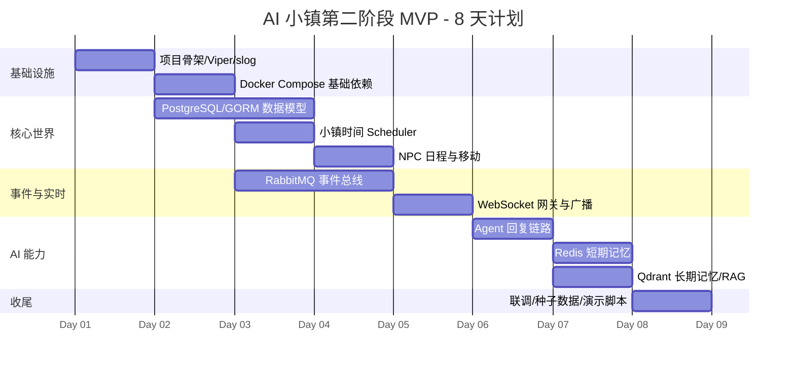

如果你希望 Mermaid Gantt 更贴近“Day 1 ~ Day 8”，也可以用下面这个版本：

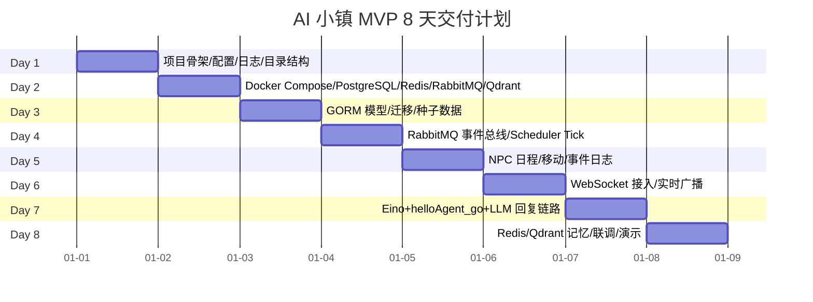

---

## 二、8 天目标拆解

## Day 1：项目骨架

### 目标

搭好 Go 项目基础，保证后面模块能快速开发。

### 任务

- 初始化 Go module
- 建立目录结构
- 接入 `Viper`
- 接入 `log/slog`
- 定义配置文件
- 定义统一启动入口
- 定义基础错误处理
- 预留 gRPC / WebSocket / Worker / Scheduler 启动点

### 交付物

```text
cmd/server/main.go
configs/config.yaml
internal/config
internal/logger
internal/app
internal/gateway
internal/worker
internal/scheduler
```

### 验收

```text
go run ./cmd/server
```

能打印启动日志、读取配置成功。

---

## Day 2：Docker Compose 基础设施

### 目标

一键启动依赖组件。

### 任务

- 编写 `docker-compose.yml`
- 启动 PostgreSQL
- 启动 Redis
- 启动 RabbitMQ Management
- 启动 Qdrant
- 配置健康检查
- Go 服务连接所有依赖

### 交付物

```text
deployments/docker-compose.yml
.env
```

### 验收

```text
docker compose up -d
```

所有容器健康，Go 服务可以连接：

- PostgreSQL
- Redis
- RabbitMQ
- Qdrant

---

## Day 3：数据模型和种子数据

### 目标

创建最小小镇数据模型。

### 任务

- 建立 GORM 连接
- 定义核心表
- 自动迁移
- 初始化一个小镇
- 初始化 3 个地点
- 初始化 3 个 NPC
- 初始化 NPC 日程

### 最小表

```text
towns
locations
npcs
npc_schedules
event_logs
chat_messages
```

### 种子数据

```text
小镇：晨曦镇

地点：
- 广场
- 咖啡馆
- 钟楼

NPC：
- 莉娜，咖啡师
- 奥托，钟表匠
- 米娅，邮差
```

### ER 图

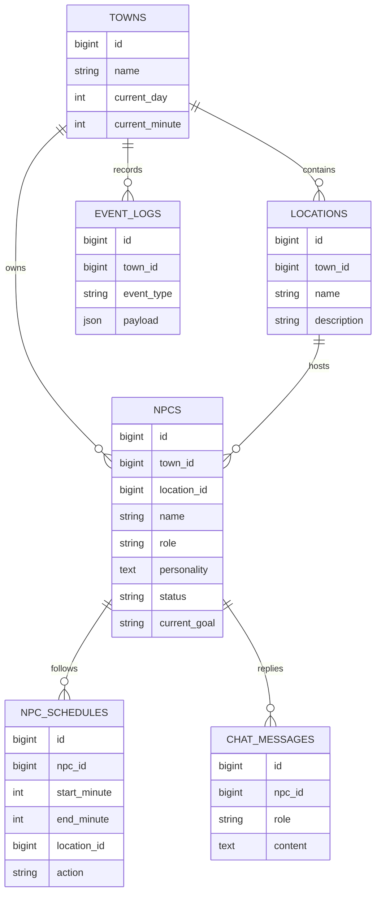

### 验收

数据库中能查到：

- 1 个 town
- 3 个 location
- 3 个 npc
- 每个 NPC 至少 3 条 schedule

---

## Day 4：RabbitMQ 事件总线 + Scheduler

### 目标

让小镇开始“有时间”。

### 任务

- 封装 RabbitMQ Publisher
- 封装 RabbitMQ Consumer
- 定义统一事件结构
- 实现 Scheduler
- 每 N 秒推进小镇时间
- 发布 `town.tick`
- 写入 `event_logs`

### 事件结构

```json
{
  "event_id": "uuid",
  "event_type": "town.tick",
  "town_id": 1,
  "actor_type": "system",
  "actor_id": "scheduler",
  "payload": {},
  "created_at": "2025-01-01T00:00:00Z"
}
```

### 流程图

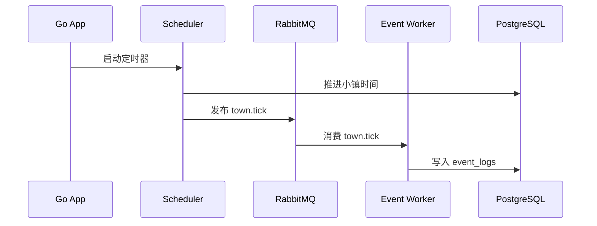

### 验收

RabbitMQ Management 中能看到 `town.tick` 事件持续产生。

PostgreSQL `event_logs` 中能看到 tick 记录。


### 结果

  ----- event 包 — 事件协议                                                                                                                                                 

  │     文件      │                                           内容                                                                                             │ event.go      │ Event 结构体（event_id, event_type, town_id, actor_type, actor_id, payload, created_at） 
  │ event_type.go │ 常量：EventTypeTownTick = "town.tick", ActorTypeSystem = "system"     
  │ codec.go      │ Marshal / Unmarshal JSON 编解码                                                          │ publisher.go  │ Publisher — 声明 exchange + queue，Publish() 发布事件                                    │ consumer.go   │ Consumer — Consume() 循环消费，Handler 回调处理                                            ----- service / scheduler / worker — 时间推进

  │ event.go      │ Event 结构体（event_id, event_type, town_id, actor_type, actor_id, payload, created_at）
  │ event_type.go │ 常量：EventTypeTownTick = "town.tick", ActorTypeSystem = "system" │ codec.go      │ Marshal / Unmarshal JSON 编解码                                                          │ publisher.go  │ Publisher — 声明 exchange + queue，Publish() 发布事件                                 │ consumer.go   │ Consumer — Consume() 循环消费，Handler 回调处理                                          ----- service / scheduler / worker — 时间推进

  │      文件       │                       内容                       │
  │ town_service.go │ AdvanceTime() — 推进 1 分钟，>=1440 分钟跨天     │
  │ scheduler.go    │ 定时器，每 N 秒调用 AdvanceTime + 发布 town.tick │
  │ event_worker.go │ 消费 town.tick → 写入 event_logs 表              │

  数据流：Scheduler → (推进时间) → TownService → (发布事件) → Publisher → RabbitMQ → Consumer → EventWorker → EventRepo → PostgreSQL


---

## Day 5：NPC 日程与移动

### 目标

让 3 个 NPC 按日程自动移动。

### 任务

- 消费 `town.tick`
- 查询当前时间对应 NPC 日程
- 生成 `npc.move.requested`
- 更新 NPC `location_id`
- 生成 `npc.moved`
- 写入事件日志

### NPC 移动流程

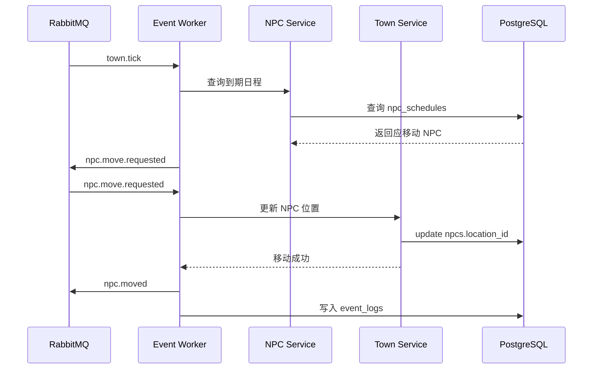

### 验收

随着时间推进：

- NPC 位置会变化
- `npcs.location_id` 会更新
- `event_logs` 有 `npc.moved`
- 日志能看到类似：

```text
npc moved: Lina cafe -> square
```

---

## Day 6：WebSocket 实时广播

### 目标

前端/测试客户端能实时看到小镇变化。

### 任务

- 实现 WebSocket 连接
- 实现用户 session 管理
- 消费 `npc.moved`
- 广播 `town.event.broadcast`
- 推送给 WebSocket 客户端
- 实现简单心跳

### WebSocket 消息格式

```json
{
  "type": "npc.moved",
  "data": {
    "npc_id": 1,
    "npc_name": "莉娜",
    "from_location": "咖啡馆",
    "to_location": "广场"
  }
}
```

### 广播流程图

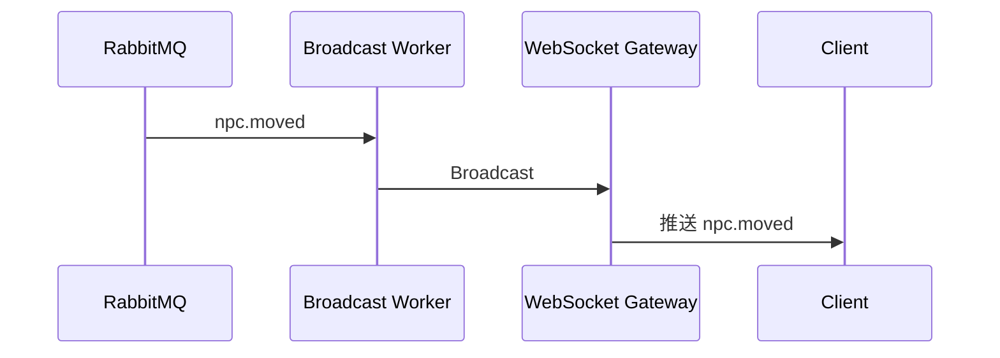

### 验收

打开 WebSocket 客户端后，能实时收到：

```text
莉娜移动到了广场
奥托移动到了钟楼
米娅移动到了咖啡馆
```

---

## Day 7：Agent 回复链路

### 目标

用户可以和 NPC 对话，NPC 能基于人设回复。

### 任务

- WebSocket 接收用户消息
- 发布 `user.message.sent`
- Worker 调用 Agent Service
- Agent 拼装上下文
- Eino + helloAgent_go 调用 LLM API
- 生成 NPC 回复
- 发布 `npc.replied`
- WebSocket 推送回复
- PostgreSQL 写入 `chat_messages`

### 对话流程

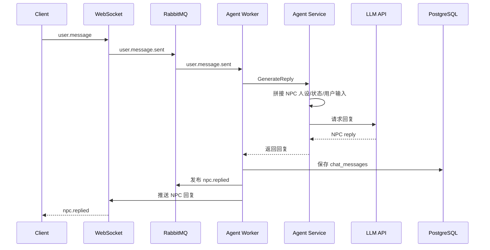

### 验收

用户发送：

```text
莉娜，今天镇上有什么新鲜事？
```

NPC 回复类似：

```text
早上好呀！我刚在咖啡馆听说奥托今天会修钟楼的大钟。
```

---

## Day 8：记忆、联调和演示

### 目标

让系统具备最小记忆能力，并完成演示闭环。

### 任务

- Redis 保存最近 5-10 条对话
- Qdrant 保存重要对话向量
- Agent 回复前读取 Redis 短期记忆
- Agent 回复前检索 Qdrant 长期记忆
- 初始化世界知识
- 编写演示脚本
- 修复联调问题
- 完成 README 快速启动说明

### 记忆流程

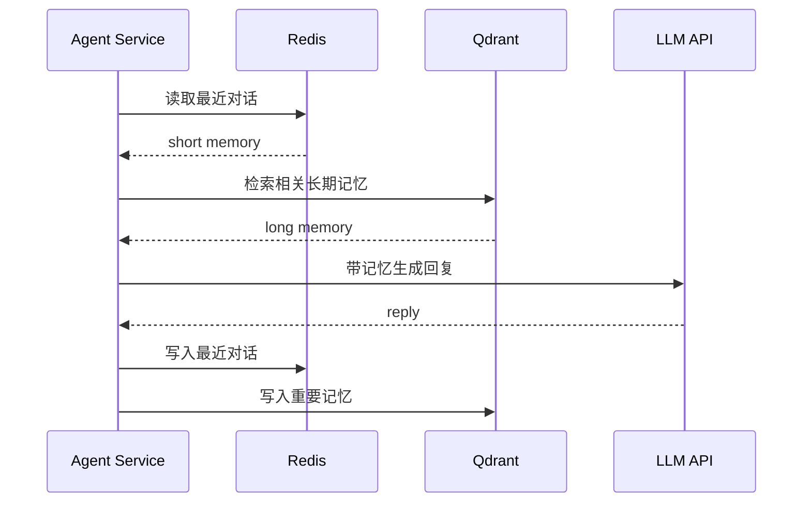

### 最终演示流程

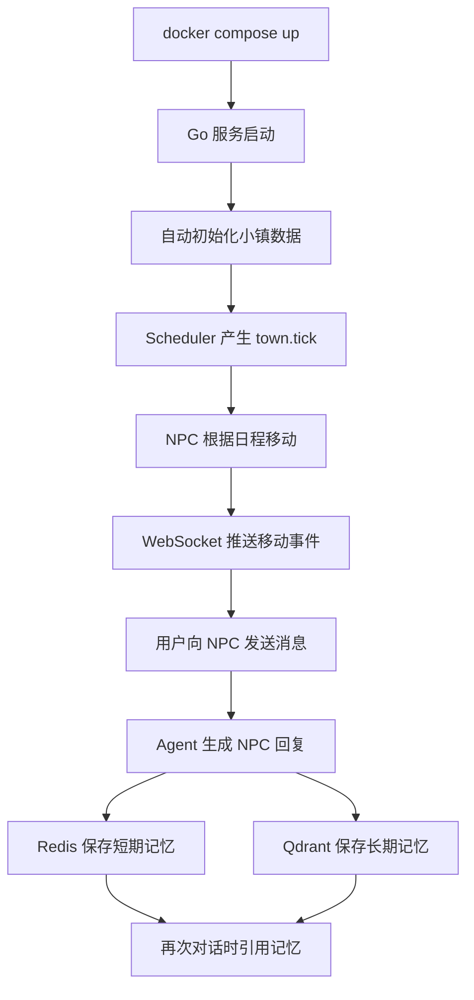

### 验收

最终必须满足：

- `docker compose up` 一键启动依赖
- `go run ./cmd/server` 启动服务
- Scheduler 自动推进小镇时间
- 3 个 NPC 自动移动
- WebSocket 能收到移动事件
- 用户能给 NPC 发消息
- NPC 能回复
- Redis 有最近对话
- Qdrant 有记忆向量
- PostgreSQL 有事件和聊天记录

---

## 三、技术依赖优先级

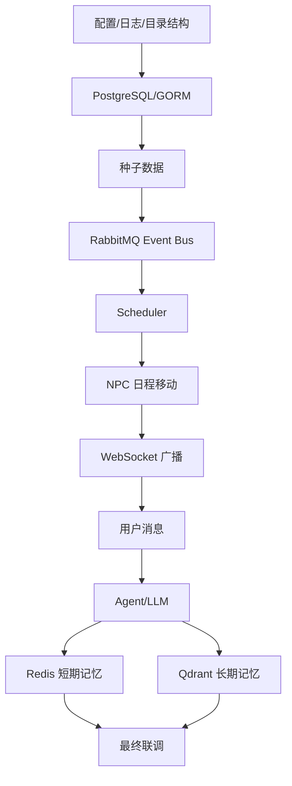

---

## 四、MVP 架构图

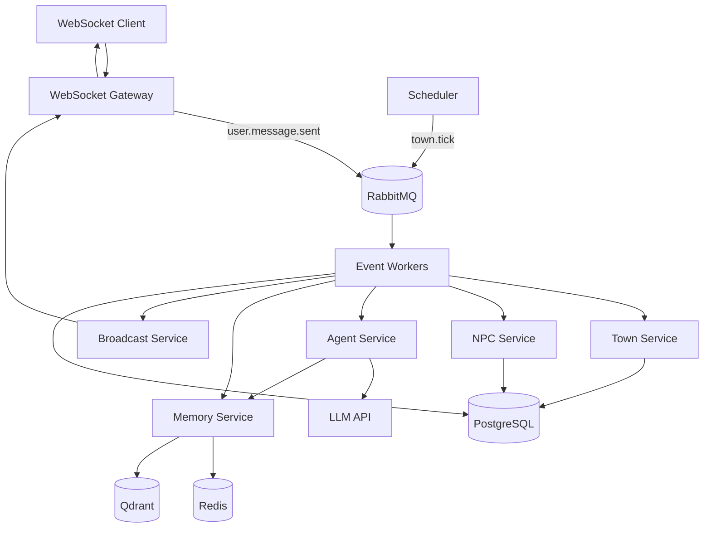

---

## 五、风险控制

| 风险              | 处理方式                       |
| --------------- | -------------------------- |
| LLM API 不稳定     | Day 7 先做 Mock LLM，再切真实 API |
| Qdrant 接入耗时     | Day 8 只做最小 upsert/search   |
| RabbitMQ 消费复杂   | 先一个 Worker 消费多类事件          |
| gRPC 接入耗时       | 第二阶段可先模块内接口，`.proto` 预留    |
| WebSocket 前端未完成 | 用 `websocat` 或简单 HTML 测试   |
| 时间不够            | 优先保证 NPC 移动 + 对话 + 记忆三件事   |

---

## 六、8 天最小验收路径

最小闭环只抓这 5 条：

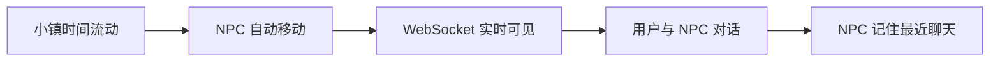

如果第 8 天只能保一条主线，优先级是：

```text
Scheduler + RabbitMQ + NPC 移动 + WebSocket 广播 + Agent 回复
```

Redis 和 Qdrant 可以做最小能力，不要追求复杂记忆系统。

---

## 七、推荐每日产出

| 天数    | 产出                       |
| -----:| ------------------------ |
| Day 1 | 服务能启动，配置和日志可用            |
| Day 2 | 依赖组件能一键启动                |
| Day 3 | 数据库有小镇、地点、NPC、日程         |
| Day 4 | RabbitMQ 能传递 `town.tick` |
| Day 5 | NPC 能按日程移动               |
| Day 6 | WebSocket 能推送 NPC 移动     |
| Day 7 | 用户能和 NPC 对话              |
| Day 8 | Redis/Qdrant 记忆 + 完整演示   |

最终你要演示的不是“技术栈很多”，而是：

> **一个小镇正在自己运转，NPC 会按时间行动，用户能介入对话，NPC 会记住发生过的事情。**
