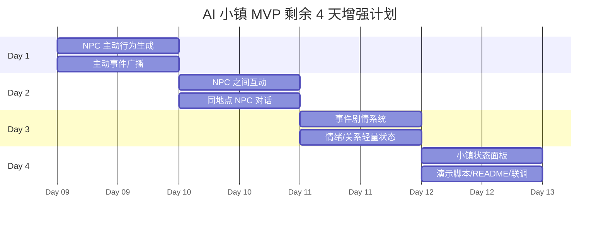
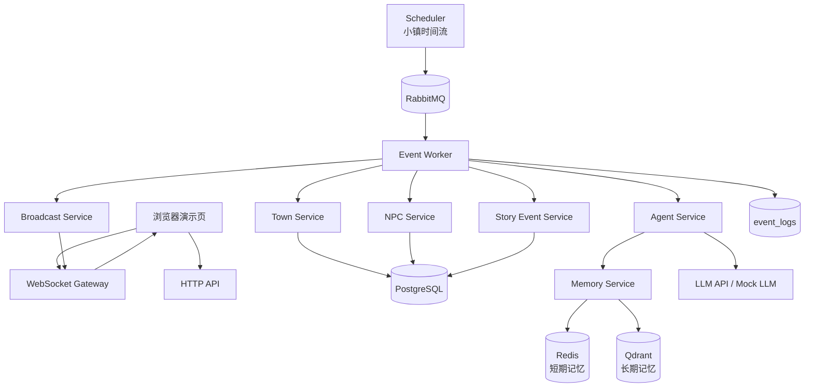
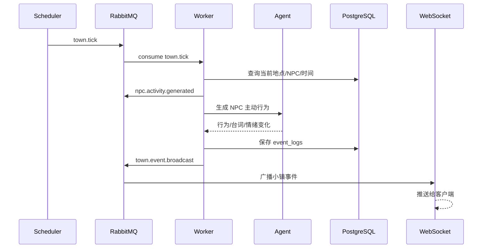
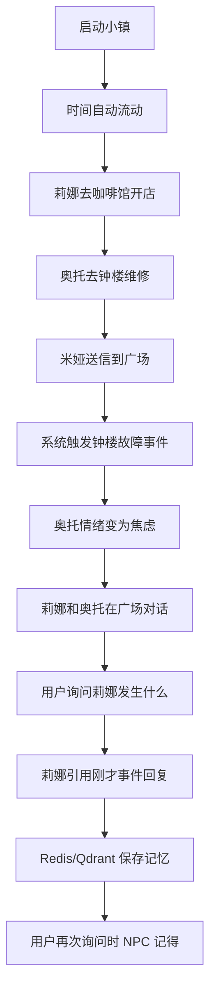

## 🤖 Assistant

如果你的 **最小运行 MVP 已经建立**，还剩 **4 天左右**，我建议不要再堆技术栈，而是补“演示感”和“生命力”。优先让用户看到：**NPC 不只是能聊天，而是在小镇里持续生活、记忆、互动、变化**。

推荐新增优先级：

```text
P0：必须增强演示效果
1. NPC 主动行为
2. NPC 之间互动
3. 事件驱动剧情
4. 可视化小镇状态面板

P1：增强 AI 感
5. 记忆摘要
6. 关系值系统
7. 情绪/状态系统

P2：有时间再做
8. 简单任务系统
9. Admin 配置台
10. Agent 调试面板
```

---

## 一、4 天最值得加什么

### 1. NPC 主动行为

现在如果只是用户问、NPC 答，生命力还不够。

建议加：

- NPC 每隔一段时间主动说一句话
- NPC 根据地点、时间、状态生成行动
- NPC 无用户参与时也会移动、思考、广播事件

例子：

```text
08:00 莉娜打开咖啡馆
09:30 米娅来到广场分发信件
12:00 奥托抱怨钟楼又慢了三分钟
18:00 莉娜关店，去广场散步
```

这是最容易让演示“活起来”的功能。

---

### 2. NPC 之间互动

这是 AI 小镇最有“生命力”的部分。

最小实现不需要复杂多 Agent 协同，只要：

- 同一地点有两个 NPC
- Scheduler 触发 `npc.interaction.required`
- 选择两个 NPC
- Agent 生成一段短对话
- 写入事件日志
- WebSocket 广播

示例：

```text
莉娜：奥托，今天钟楼又响慢了吗？
奥托：别急，我正在修。只是它比我还固执。
```

---

### 3. 简单事件剧情系统

不要做复杂任务系统，可以做“事件模板”。

例如：

```text
event_templates
- 钟楼故障
- 咖啡馆新菜单
- 邮件丢失
- 广场集市
- 神秘旅人到访
```

事件触发后影响小镇：

- NPC 状态变化
- NPC 对话内容变化
- NPC 行程变化
- 用户可参与询问

这会让小镇从“NPC 定时移动”升级为“世界在发生事情”。

---

### 4. 小镇状态面板

如果你要演示，强烈建议加一个最简单的页面。

不需要完整前端，单页即可：

- 当前小镇时间
- 3 个 NPC 当前地点
- 最新 20 条事件
- WebSocket 实时滚动
- 输入框：向某个 NPC 发消息

这比纯接口演示效果好很多。

技术上可以直接放：

```text
web/index.html
```

Go 后端静态托管即可。

---

## 二、4 天推荐排期



---

## 三、推荐最终增强架构



---

## 四、建议新增事件类型

你现在已有：

```text
town.tick
npc.moved
user.message.sent
npc.replied
```

建议再加这些：

```text
npc.thought.generated
npc.activity.generated
npc.interaction.required
npc.interaction.generated
story.event.triggered
npc.mood.changed
npc.relationship.changed
town.news.generated
```

事件流可以这样：



---

## 五、数据库最小新增字段

不要大改表，轻量加字段即可。

### `npcs` 表建议增加

```text
mood           当前情绪，例如 happy/tired/curious/angry
energy         精力值，0-100
current_goal   当前目标
last_active_at 上次主动行为时间
```

### 新增 `npc_relationships`

```text
id
npc_id
target_npc_id
affinity     好感度
trust        信任度
updated_at
```

### 新增 `story_events`

```text
id
town_id
title
description
status
trigger_minute
created_at
```

如果时间紧，`npc_relationships` 和 `story_events` 可以都先用 `event_logs.payload` 存，不一定马上建表。

---

## 六、Agent Prompt 最小升级

现在 Agent 可能只基于人设回复。建议升级成：

```text
你是 AI 小镇中的 NPC。

你的身份：
{name}, {role}

你的性格：
{personality}

当前状态：
- 时间：{town_time}
- 地点：{location}
- 情绪：{mood}
- 当前目标：{current_goal}

最近记忆：
{short_memory}

相关长期记忆：
{long_memory}

当前事件：
{event}

请生成：
1. 一句话自然回复
2. 一个行为动作
3. 情绪变化
4. 是否需要记忆
```

建议让 LLM 输出 JSON，方便后端处理：

```json
{
  "speech": "今天的钟声听起来有点怪。",
  "action": "抬头望向钟楼",
  "mood": "curious",
  "importance": 0.7,
  "should_remember": true
}
```

---

## 七、4 天内最推荐的最终演示剧本

演示不要只展示接口，要展示一个“故事”。



最终用户看到的是：

```text
[08:00] 莉娜移动到咖啡馆
[08:30] 米娅移动到广场
[09:00] 钟楼突然停摆
[09:01] 奥托变得焦虑
[09:05] 奥托：这不应该发生，我昨晚才修好它。
[09:06] 莉娜：别担心，我给你带杯咖啡。
用户：莉娜，钟楼怎么了？
莉娜：奥托说钟楼又停了，他看起来很焦虑。我刚准备给他送杯咖啡。
```

这就是“生命力”。

---

## 八、如果只能选 3 个功能

我建议只做这 3 个：

```text
1. NPC 主动行为
2. NPC 之间互动
3. 小镇状态 Web 页面
```

原因：

- 用户感知最强
- 演示效果最好
- 技术风险最低
- 不需要大改架构
- 能明显区别于普通聊天机器人

---

## 九、不要做什么

剩 4 天不建议做：

```text
Kubernetes
复杂 gRPC 微服务拆分
完整 Admin 后台
复杂任务系统
复杂多 Agent 规划器
复杂权限系统
复杂 ES 检索
完整 Prometheus/Grafana
复杂前端工程
```

这些都是后续工程化内容，不是当前 MVP 的核心增量。

---

## 十、最终建议

你现在最应该补的是：

> **让小镇自己产生故事，而不是只等用户发消息。**

4 天版本目标可以定为：

```text
docker compose up 后，小镇自动运转；
NPC 会移动、主动说话、彼此互动；
随机事件会改变 NPC 情绪和对话；
用户打开一个页面就能看到实时事件流，并能介入对话。
```

这样你的 MVP 会从“技术可运行”升级为“产品可演示”。
