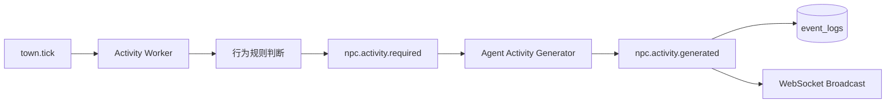
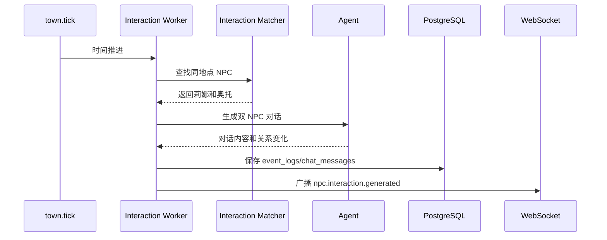
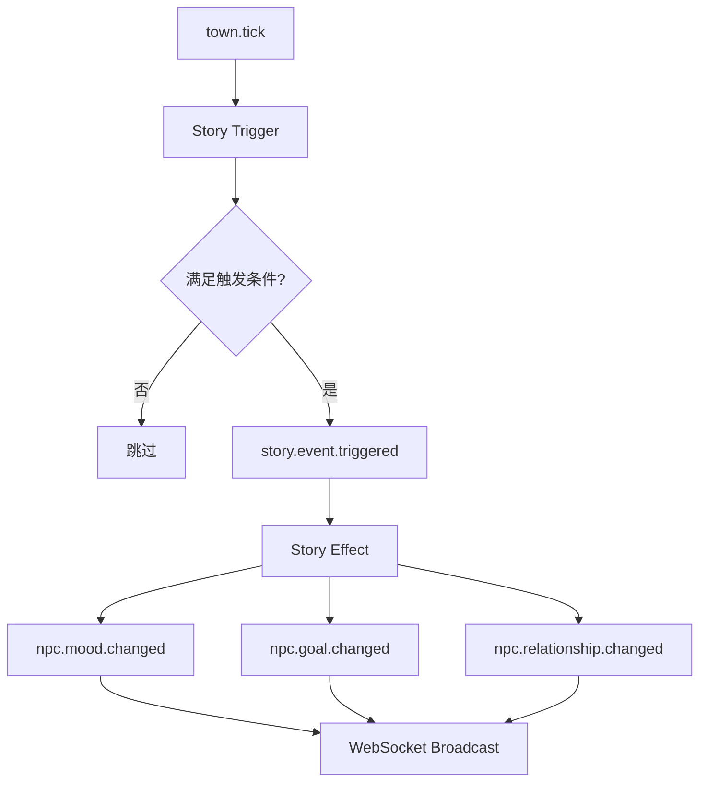
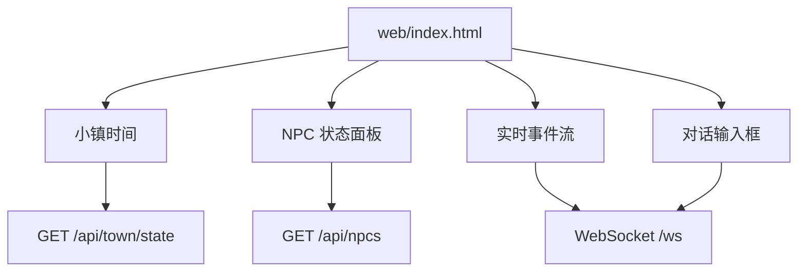
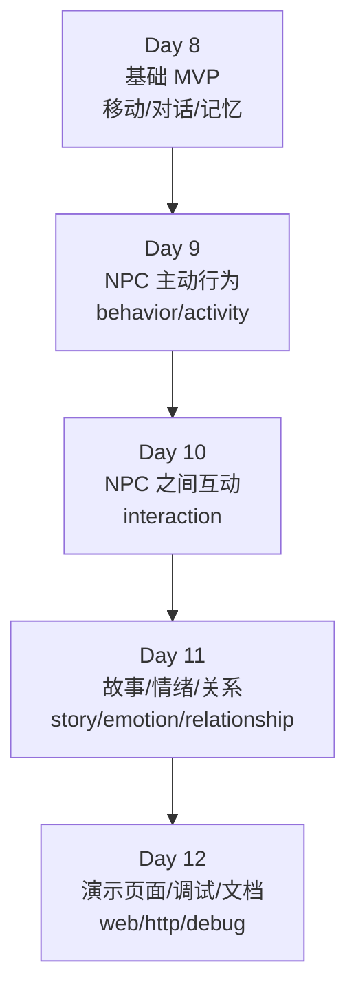
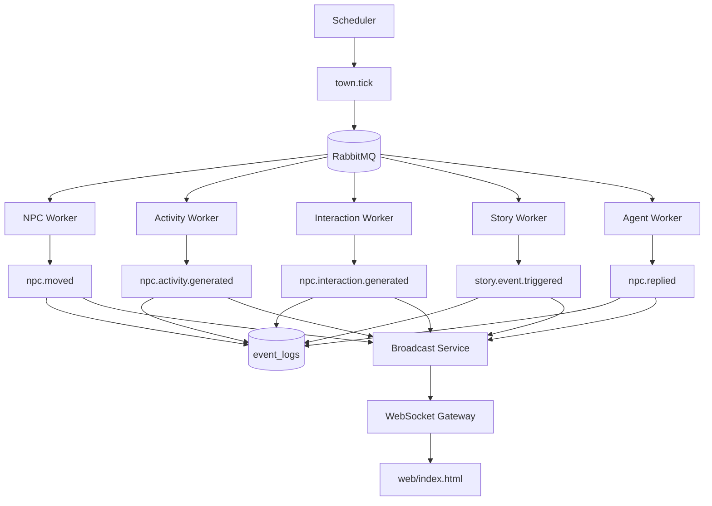

## 🤖 Assistant

下面续写 **`项目目录演进.md`**，基于你已经完成的 8 天 MVP，继续规划 **剩余 4 天增强版目录演进**。目标从“能跑”升级为：

> 小镇不仅能移动和对话，还能主动产生故事、NPC 彼此互动、情绪关系变化，并通过一个演示页面实时展示。

---

# Day 9：NPC 主动行为与自发事件

目标：NPC 不再只响应用户，而是会在小镇时间流动中主动说话、行动、思考。

```text
ai-town/
├── internal/
│   ├── agent/
│   │   ├── agent_service.go
│   │   ├── prompt_builder.go
│   │   ├── llm_client.go
│   │   ├── eino_runner.go
│   │   ├── hello_agent_adapter.go
│   │   └── activity_generator.go        # 新增：生成 NPC 主动行为
│   ├── behavior/
│   │   ├── behavior_service.go          # 新增：NPC 行为决策入口
│   │   ├── activity_rule.go             # 新增：主动行为规则
│   │   └── activity_template.go         # 新增：兜底行为模板
│   ├── event/
│   │   ├── event_type.go                # 新增 npc.activity.required / npc.activity.generated
│   │   └── ...
│   ├── worker/
│   │   ├── npc_worker.go
│   │   ├── agent_worker.go
│   │   ├── activity_worker.go           # 新增：处理 NPC 主动行为
│   │   └── ...
│   ├── service/
│   │   ├── npc_service.go               # 增加 NPC 当前状态读取
│   │   └── town_service.go
│   ├── model/
│   │   ├── npc.go                       # 增加 mood/energy/current_goal/last_active_at
│   │   └── ...
│   └── repository/
│       ├── npc_repository.go            # 增加按活跃时间查询 NPC
│       └── ...
```

## Day 9 新增职责

| 文件 | 作用 |
|---|---|
| `internal/behavior/behavior_service.go` | 判断 NPC 是否需要主动行动 |
| `internal/behavior/activity_rule.go` | 根据时间、地点、状态触发行为 |
| `internal/behavior/activity_template.go` | LLM 不可用时生成兜底行为 |
| `internal/agent/activity_generator.go` | 让 Agent 生成主动台词和动作 |
| `internal/worker/activity_worker.go` | 消费主动行为事件并落库、广播 |

## Day 9 新增事件

```text
npc.activity.required
npc.activity.generated
npc.thought.generated
npc.mood.changed
```

## Day 9 行为链路



## Day 9 验收

能看到 NPC 自发事件：

```text
[08:10] 莉娜擦了擦咖啡杯，望向窗外。
[08:30] 米娅整理邮包，准备去广场送信。
[09:00] 奥托站在钟楼下，皱着眉头听钟声。
```

---

# Day 10：NPC 之间互动

目标：同一地点的 NPC 会彼此交谈，产生小镇社交感。

```text
ai-town/
├── internal/
│   ├── interaction/
│   │   ├── interaction_service.go       # 新增：NPC 互动业务入口
│   │   ├── interaction_matcher.go       # 新增：匹配同地点 NPC
│   │   ├── interaction_prompt.go        # 新增：双 NPC 对话 Prompt
│   │   └── interaction_result.go        # 新增：互动结果结构
│   ├── agent/
│   │   ├── agent_service.go
│   │   ├── activity_generator.go
│   │   └── interaction_generator.go     # 新增：生成 NPC 间对话
│   ├── worker/
│   │   ├── interaction_worker.go        # 新增：消费互动事件
│   │   ├── activity_worker.go
│   │   └── ...
│   ├── event/
│   │   ├── event_type.go                # 新增 npc.interaction.required / generated
│   │   └── ...
│   ├── model/
│   │   ├── npc_relationship.go          # 新增：NPC 关系表，可选
│   │   └── ...
│   └── repository/
│       ├── relationship_repository.go   # 新增：NPC 关系数据访问，可选
│       └── ...
```

## Day 10 新增职责

| 文件 | 作用 |
|---|---|
| `interaction_service.go` | 处理 NPC 互动主流程 |
| `interaction_matcher.go` | 找出同地点、可互动 NPC |
| `interaction_prompt.go` | 拼装双 NPC 对话上下文 |
| `interaction_generator.go` | 调用 LLM 生成 NPC 对话 |
| `interaction_worker.go` | 消费互动事件并广播 |
| `npc_relationship.go` | 保存 NPC 关系值，可先简化 |

## Day 10 新增事件

```text
npc.interaction.required
npc.interaction.generated
npc.relationship.changed
```

## Day 10 互动链路



## Day 10 验收

WebSocket 能看到 NPC 之间的自然互动：

```text
[09:15] 莉娜：奥托，你又在听钟声吗？
[09:15] 奥托：它今天慢了三分钟，这可不是小事。
[09:16] 莉娜：那你需要一杯咖啡。
```

---

# Day 11：故事事件、情绪和关系系统

目标：小镇可以发生“剧情事件”，事件会影响 NPC 情绪、目标和关系。

```text
ai-town/
├── internal/
│   ├── story/
│   │   ├── story_service.go             # 新增：故事事件服务
│   │   ├── story_trigger.go             # 新增：事件触发规则
│   │   ├── story_template.go            # 新增：故事事件模板
│   │   └── story_effect.go              # 新增：事件影响 NPC 状态
│   ├── emotion/
│   │   ├── emotion_service.go           # 新增：情绪更新服务
│   │   └── emotion_rule.go              # 新增：情绪变化规则
│   ├── relationship/
│   │   ├── relationship_service.go      # 新增：关系值更新
│   │   └── relationship_rule.go         # 新增：关系变化规则
│   ├── event/
│   │   ├── event_type.go                # 新增 story.event.triggered
│   │   └── ...
│   ├── worker/
│   │   ├── story_worker.go              # 新增：处理故事事件
│   │   ├── interaction_worker.go
│   │   └── ...
│   ├── model/
│   │   ├── story_event.go               # 新增：故事事件表
│   │   ├── npc_relationship.go
│   │   └── npc.go
│   ├── repository/
│   │   ├── story_repository.go          # 新增：故事事件数据访问
│   │   ├── relationship_repository.go
│   │   └── ...
│   └── seed/
│       ├── seed.go
│       ├── world_knowledge.go
│       └── story_seed.go                # 新增：初始化故事模板
```

## Day 11 新增职责

| 文件 | 作用 |
|---|---|
| `story_service.go` | 故事事件主流程 |
| `story_trigger.go` | 判断何时触发剧情 |
| `story_template.go` | 预设故事模板 |
| `story_effect.go` | 修改 NPC 情绪、目标、关系 |
| `emotion_service.go` | 统一更新 NPC 情绪 |
| `relationship_service.go` | 更新 NPC 之间关系 |
| `story_worker.go` | 消费故事事件并广播 |

## Day 11 新增事件

```text
story.event.triggered
story.effect.applied
npc.mood.changed
npc.goal.changed
npc.relationship.changed
town.news.generated
```

## Day 11 故事链路



## Day 11 示例故事模板

```text
1. 钟楼故障
   - 触发时间：上午
   - 影响：奥托 mood=anxious
   - 影响：奥托 current_goal=修好钟楼

2. 咖啡馆新菜单
   - 触发时间：中午
   - 影响：莉娜 mood=excited
   - 影响：莉娜 current_goal=邀请镇民试喝

3. 邮件丢失
   - 触发时间：下午
   - 影响：米娅 mood=worried
   - 影响：米娅 current_goal=寻找丢失邮件
```

## Day 11 验收

能看到故事影响 NPC 行为：

```text
[09:00] 钟楼突然停摆，广场上的人都抬头望去。
[09:01] 奥托的情绪变为 anxious。
[09:02] 奥托的目标变为：修好钟楼。
[09:10] 莉娜：奥托看起来很焦虑，也许我该给他送杯咖啡。
```

---

# Day 12：演示页面、调试面板和收尾

目标：用一个页面展示小镇实时状态、事件流、NPC 对话入口，让 MVP 具备产品演示感。

```text
ai-town/
├── web/
│   ├── index.html                       # 新增：小镇演示页面
│   ├── app.js                           # 新增：WebSocket 连接和页面逻辑
│   └── style.css                        # 新增：基础样式
├── docs/
│   ├── architecture.md
│   ├── events.md
│   ├── demo.md                          # 更新：完整演示脚本
│   ├── api.md                           # 新增：HTTP/WebSocket 消息说明
│   └── roadmap.md                       # 新增：后续路线
├── scripts/
│   ├── dev.sh
│   ├── ws_test.html
│   ├── reset_demo_data.sh               # 新增：重置演示数据
│   └── demo_flow.sh                     # 新增：演示辅助脚本，可选
├── internal/
│   ├── gateway/
│   │   ├── http/
│   │   │   ├── router.go                # 新增：HTTP 路由
│   │   │   ├── town_handler.go          # 新增：查询小镇状态
│   │   │   ├── npc_handler.go           # 新增：查询 NPC 状态
│   │   │   └── static_handler.go        # 新增：托管 web/index.html
│   │   └── websocket/
│   │       └── ...
│   ├── debug/
│   │   ├── debug_handler.go             # 新增：调试接口，可选
│   │   └── event_replay.go              # 新增：事件回放，可选
│   ├── app/
│   │   └── app.go                       # 更新：启动 HTTP + WebSocket + 静态页面
│   └── ...
```

## Day 12 新增职责

| 文件 | 作用 |
|---|---|
| `web/index.html` | 小镇可视化演示页 |
| `web/app.js` | 连接 WebSocket、渲染事件流 |
| `web/style.css` | 简单样式 |
| `gateway/http/router.go` | HTTP 路由入口 |
| `town_handler.go` | 返回当前小镇时间和状态 |
| `npc_handler.go` | 返回 NPC 位置、情绪、目标 |
| `static_handler.go` | 托管前端静态文件 |
| `docs/demo.md` | 最终演示流程 |
| `scripts/reset_demo_data.sh` | 快速重置演示数据 |

## Day 12 页面能力

```text
1. 展示当前小镇时间
2. 展示 NPC 当前地点
3. 展示 NPC 情绪和目标
4. 实时滚动事件流
5. 选择 NPC 并发送消息
6. 展示 NPC 回复
7. 展示故事事件
8. 展示 NPC 之间互动
```

## Day 12 页面结构



---

# Day 9 - Day 12 最终目录结构

```text
ai-town/
├── cmd/
│   └── server/
│       └── main.go
├── configs/
│   └── config.yaml
├── deployments/
│   └── docker-compose.yml
├── docs/
│   ├── architecture.md
│   ├── events.md
│   ├── demo.md
│   ├── api.md
│   └── roadmap.md
├── scripts/
│   ├── dev.sh
│   ├── ws_test.html
│   ├── reset_demo_data.sh
│   └── demo_flow.sh
├── web/
│   ├── index.html
│   ├── app.js
│   └── style.css
├── internal/
│   ├── app/
│   │   └── app.go
│   ├── config/
│   │   └── config.go
│   ├── logger/
│   │   └── logger.go
│   ├── infra/
│   │   ├── postgres.go
│   │   ├── redis.go
│   │   ├── rabbitmq.go
│   │   └── qdrant.go
│   ├── gateway/
│   │   ├── http/
│   │   │   ├── router.go
│   │   │   ├── town_handler.go
│   │   │   ├── npc_handler.go
│   │   │   └── static_handler.go
│   │   └── websocket/
│   │       ├── server.go
│   │       ├── client.go
│   │       ├── hub.go
│   │       ├── message.go
│   │       └── handler.go
│   ├── event/
│   │   ├── event.go
│   │   ├── event_type.go
│   │   ├── publisher.go
│   │   ├── consumer.go
│   │   └── codec.go
│   ├── scheduler/
│   │   └── scheduler.go
│   ├── worker/
│   │   ├── event_worker.go
│   │   ├── npc_worker.go
│   │   ├── broadcast_worker.go
│   │   ├── agent_worker.go
│   │   ├── memory_worker.go
│   │   ├── activity_worker.go
│   │   ├── interaction_worker.go
│   │   └── story_worker.go
│   ├── service/
│   │   ├── town_service.go
│   │   └── npc_service.go
│   ├── behavior/
│   │   ├── behavior_service.go
│   │   ├── activity_rule.go
│   │   └── activity_template.go
│   ├── interaction/
│   │   ├── interaction_service.go
│   │   ├── interaction_matcher.go
│   │   ├── interaction_prompt.go
│   │   └── interaction_result.go
│   ├── story/
│   │   ├── story_service.go
│   │   ├── story_trigger.go
│   │   ├── story_template.go
│   │   └── story_effect.go
│   ├── emotion/
│   │   ├── emotion_service.go
│   │   └── emotion_rule.go
│   ├── relationship/
│   │   ├── relationship_service.go
│   │   └── relationship_rule.go
│   ├── agent/
│   │   ├── agent_service.go
│   │   ├── prompt_builder.go
│   │   ├── llm_client.go
│   │   ├── eino_runner.go
│   │   ├── hello_agent_adapter.go
│   │   ├── activity_generator.go
│   │   └── interaction_generator.go
│   ├── memory/
│   │   ├── memory_service.go
│   │   ├── short_memory.go
│   │   ├── long_memory.go
│   │   ├── embedding.go
│   │   └── qdrant_collection.go
│   ├── chat/
│   │   └── chat_service.go
│   ├── broadcast/
│   │   └── broadcast_service.go
│   ├── model/
│   │   ├── town.go
│   │   ├── location.go
│   │   ├── npc.go
│   │   ├── npc_schedule.go
│   │   ├── npc_relationship.go
│   │   ├── story_event.go
│   │   ├── event_log.go
│   │   └── chat_message.go
│   ├── repository/
│   │   ├── town_repository.go
│   │   ├── location_repository.go
│   │   ├── npc_repository.go
│   │   ├── schedule_repository.go
│   │   ├── relationship_repository.go
│   │   ├── story_repository.go
│   │   ├── event_repository.go
│   │   └── chat_repository.go
│   ├── seed/
│   │   ├── seed.go
│   │   ├── world_knowledge.go
│   │   └── story_seed.go
│   └── debug/
│       ├── debug_handler.go
│       └── event_replay.go
├── pkg/
│   └── errors/
│       └── errors.go
├── .env.example
├── .gitignore
├── go.mod
└── README.md
```

---

# Day 9 - Day 12 演进图



---

# 增强后核心运行链路



---

# 新增模块边界说明

| 模块 | 职责 | 是否必须 |
|---|---|---|
| `behavior` | NPC 主动行为决策 | 强烈建议 |
| `interaction` | NPC 之间互动 | 强烈建议 |
| `story` | 故事事件触发和影响 | 建议 |
| `emotion` | 情绪变化规则 | 可轻量实现 |
| `relationship` | NPC 关系变化 | 可轻量实现 |
| `web` | 演示页面 | 强烈建议 |
| `debug` | 调试和事件回放 | 可选 |

---

# 4 天最小落地优先级

如果时间很紧，按这个顺序做：

```text
1. web/index.html + WebSocket 事件流
2. NPC 主动行为 activity_worker
3. NPC 之间互动 interaction_worker
4. story_event 简单模板
5. mood/current_goal 字段
6. relationship 可先只写 event_logs
```

不要一开始把 `emotion`、`relationship`、`story` 都做复杂。MVP 可以先用规则和模板驱动。

---

# 最终演示闭环

```mermaid
flowchart LR
    A[docker compose up] --> B[Go 服务启动]
    B --> C[打开演示页面]
    C --> D[小镇时间自动流动]
    D --> E[NPC 按日程移动]
    E --> F[NPC 主动说话]
    F --> G[NPC 彼此互动]
    G --> H[故事事件触发]
    H --> I[NPC 情绪/目标变化]
    I --> J[用户介入对话]
    J --> K[NPC 引用刚才事件回复]
    K --> L[记忆保存到 Redis/Qdrant]
```



---

# 续写后的产品效果

完成 Day 12 后，你的项目不再只是：

```text
用户问 NPC，NPC 回答。
```

而是变成：

```text
小镇自己运转；
NPC 会移动、主动说话、互相交流；
故事事件会影响 NPC 情绪和目标；
用户可以通过页面观察小镇，也可以介入其中；
NPC 会记住发生过的事情。
```

这就是一个更有生命力的 AI 小镇 MVP。
