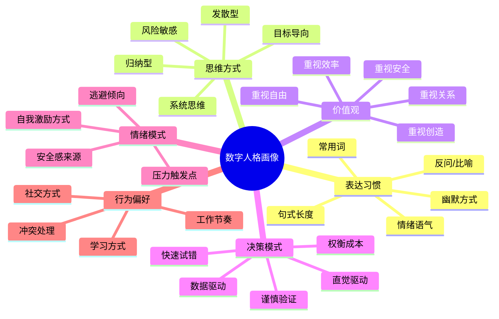
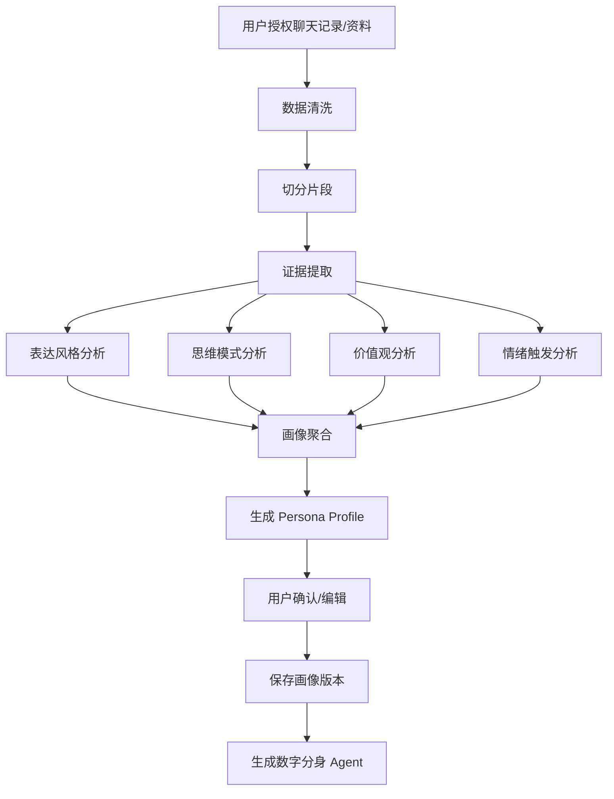
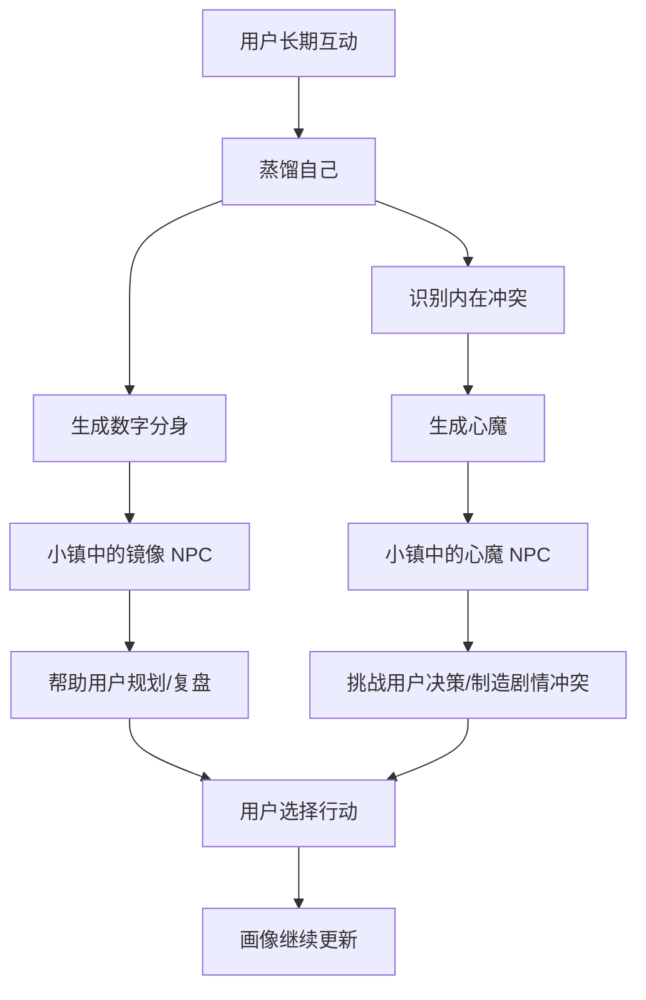
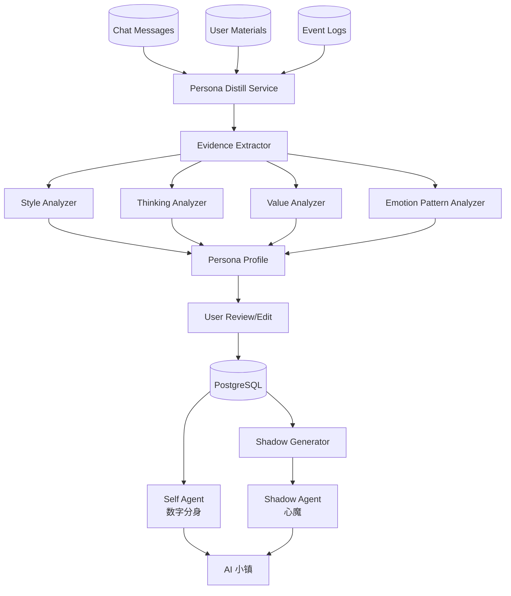

## 🤖 Assistant

可以添加，而且这是 AI 小镇里非常有差异化的功能。建议把它设计成：

> **人格蒸馏 Persona Distillation**：从聊天记录、行为记录、记忆资料中提炼“数字人格画像”。  
> **蒸馏自己 Self Distillation**：用户生成自己的数字人格镜像。  
> **心魔 Shadow Persona**：基于用户画像生成一个“反向压力源 / 内在冲突体”，用于剧情、反思、挑战，而不是医学诊断。

---

## 一、产品定位

不要把“心魔”做成玄学或心理诊断，建议定位为：

```text
数字人格镜像 + 价值冲突模拟 + 剧情化反身智能体
```

也就是：

- “蒸馏自己”：生成用户的数字人格画像。
- “心魔”：不是恶意人格，而是用户内在矛盾、焦虑、执念、逃避模式的拟人化角色。
- 在 AI 小镇中，心魔可以作为特殊 NPC、梦境角色、内心副本 Boss、反思教练、剧情触发器。

---

## 二、人格蒸馏维度

建议不要只做“说话风格”，而是拆成多维画像。



---

## 三、可以新增的核心模块

在你现有 AI 小镇 MVP 上，可以加这些模块：

```text
internal/persona/
├── distill_service.go          # 人格蒸馏主流程
├── profile_schema.go           # 数字人格画像结构
├── evidence_extractor.go       # 从聊天/资料中提取证据
├── trait_scorer.go             # 特质评分
├── style_analyzer.go           # 表达风格分析
├── value_analyzer.go           # 价值观分析
├── persona_generator.go        # 生成数字人格描述
└── persona_version.go          # 人格版本管理

internal/shadow/
├── shadow_service.go           # 心魔生成主流程
├── conflict_detector.go        # 内在冲突识别
├── shadow_prompt.go            # 心魔 Prompt
├── shadow_agent.go             # 心魔 Agent
└── shadow_safety.go            # 安全边界控制
```

---

## 四、人格画像数据结构

建议画像不要只存一段文本，而是结构化存储。

```json
{
  "user_id": 1,
  "version": 3,
  "summary": "目标导向、强执行欲、对低效敏感，表达直接，偏系统化思考。",
  "thinking_style": {
    "systematic": 0.86,
    "creative": 0.78,
    "risk_sensitive": 0.62,
    "detail_oriented": 0.71
  },
  "values": {
    "efficiency": 0.91,
    "freedom": 0.83,
    "achievement": 0.88,
    "stability": 0.47,
    "relationship": 0.55
  },
  "expression_style": {
    "tone": "直接、目标明确、偏产品经理式表达",
    "sentence_pattern": "常用问题拆解、分点陈述、追求落地",
    "keywords": ["最小可运行", "架构", "闭环", "演示", "生命力"]
  },
  "emotional_patterns": {
    "stress_triggers": ["时间不足", "系统复杂度失控", "目标不清晰"],
    "comfort_sources": ["清晰计划", "可验证结果", "阶段性交付"]
  },
  "decision_pattern": {
    "default_mode": "先搭 MVP，再迭代增强",
    "risk_control": "倾向压缩范围，优先保证闭环"
  },
  "evidence": [
    {
      "source": "chat",
      "quote": "最小运行MVP已建立，我还有4左右的时间，还能添加什么",
      "inference": "关注有限时间内的高价值增量"
    }
  ]
}
```

---

## 五、“蒸馏自己”流程



关键点：**必须让用户确认和编辑**，因为人格蒸馏一定会有误判。

---

## 六、“心魔”怎么生成

“心魔”不是简单反派，而是从画像中提取冲突面。

### 生成来源

| 画像维度   | 心魔映射       |
| ------ | ---------- |
| 高效率追求  | 嘲讽拖延、攻击低效  |
| 高成就需求  | 放大失败恐惧     |
| 强控制感   | 制造不确定感     |
| 系统化思维  | 质疑灵感和冒险    |
| 自由价值高  | 厌恶束缚和重复    |
| 时间压力敏感 | 不断提醒“来不及了” |

### 心魔人格结构

```json
{
  "name": "迟暮审判者",
  "archetype": "内在批评者",
  "origin": "来自用户对时间浪费和目标失控的恐惧",
  "core_conflict": "你想快速构建有生命力的系统，但害怕复杂度失控导致无法完成。",
  "speaking_style": "尖锐、冷静、反问式、抓漏洞",
  "attack_patterns": [
    "质疑你的计划是否过大",
    "放大未完成风险",
    "提醒你没有验证用户真正需要"
  ],
  "positive_function": "逼迫用户聚焦关键目标，减少幻想式扩张",
  "safety_rules": [
    "不得羞辱用户人格",
    "不得诱导自伤或极端行为",
    "不得做心理诊断",
    "必须在挑战后给出可执行建议"
  ]
}
```

---

## 七、在 AI 小镇里的玩法设计

可以把“蒸馏自己”和“心魔”做成一个剧情系统。



### 示例场景

```text
用户：我还剩 4 天，想继续加功能。

数字分身：你倾向先做可演示闭环，所以应该优先做页面、主动行为和 NPC 互动。

心魔：你又想加太多东西了。你确定不是在用“架构扩展”逃避真正的验收吗？
```

这类对话很有产品张力。

---

## 八、最小 MVP 怎么做

不要一开始做复杂人格系统。建议 2 天能加一个最小版。

### MVP 功能

```text
1. 从最近 N 条聊天记录蒸馏用户画像
2. 输出结构化 persona_profile
3. 用户可确认/编辑
4. 基于 persona_profile 生成 self_agent
5. 基于 persona_profile 生成 shadow_agent
6. 小镇中可分别与“自己”和“心魔”对话
```

### 最小数据表

```text
persona_profiles
- id
- user_id
- version
- summary
- traits_json
- values_json
- style_json
- evidence_json
- created_at

shadow_personas
- id
- user_id
- persona_profile_id
- name
- archetype
- core_conflict
- prompt
- safety_rules_json
- created_at
```

---

## 九、系统架构图



---

## 十、安全边界必须做

这个功能涉及用户心理画像，必须加边界。

### 必须有

```text
1. 用户显式授权数据来源
2. 展示画像依据 evidence
3. 用户可以编辑/删除画像
4. 心魔不能进行心理诊断
5. 心魔不能羞辱、PUA、诱导自伤
6. 心魔必须提供建设性出口
7. 高风险表达触发安全回复
```

### 心魔输出规则

建议固定成：

```text
先挑战，再解释，再给出口。
```

例子：

```text
挑战：你是不是又想把范围扩大到无法完成？
解释：你过去多次把“增强架构”当成继续推进的理由。
出口：现在只保留 3 件事：主动行为、NPC 互动、演示页面。
```

---

## 十一、推荐加入你的 4 天计划

如果你还剩 4 天，不建议完整做大系统。可以插入一个轻量版本：

```text
Day 1：persona_profile 表 + 蒸馏 Prompt
Day 2：生成数字分身 Agent
Day 3：生成心魔 Shadow Agent + 安全规则
Day 4：接入小镇页面，允许用户对话
```

但如果你原本已经要做 NPC 主动行为和演示页，优先级建议是：

```text
P0：演示页面
P0：NPC 主动行为
P1：NPC 之间互动
P1：蒸馏自己 + 心魔
P2：复杂关系/情绪系统
```

---

## 十二、最终建议

可以加，而且建议作为你的 AI 小镇核心差异点之一。

一句话定义：

> **蒸馏自己生成数字分身，心魔生成内在冲突体；二者共同构成用户在 AI 小镇中的“自我镜像系统”。**

最小实现不要追求心理学准确性，重点做：

```text
可授权
可解释
可编辑
可对话
有边界
能推动剧情
```

这样既有产品冲击力，也能控制工程和安全风险。
