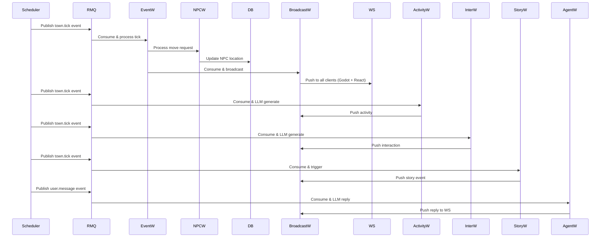
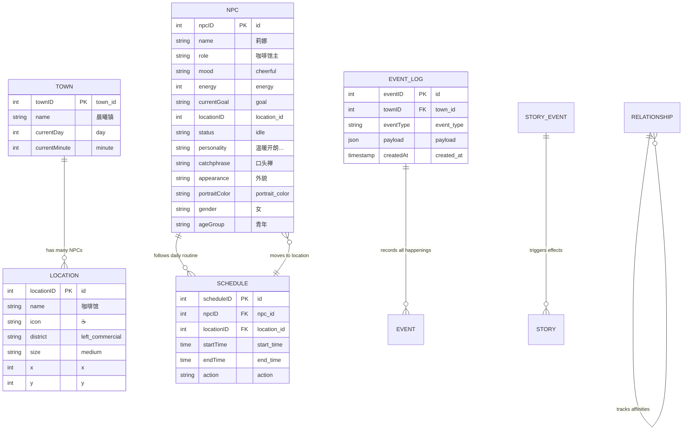

# CyberTown 晨曦镇 — 整体设计文档

> 版本: 1.0 | 最后更新: 2026-06-25

---

## 一、项目概述

CyberTown（晨曦镇）是一个 AI 驱动的小镇模拟系统。15个具有独立人格、日程、记忆和社交关系的 NPC 在一个动态小镇中自主生活。系统采用事件驱动架构，通过 RabbitMQ 进行异步通信，通过 WebSocket 向前端实时推送 NPC 行为，通过 LLM（大语言模型）生成 NPC 对话和行动。

### 核心特性

- **15个 NPC** 各有 OCEAN 性格特质、人设、口头禅、外貌
- **事件驱动架构**：RabbitMQ Topic Exchange → 多 Worker 并行消费
- **实时推送**：WebSocket 广播到所有客户端（Godot + React）
- **LLM Agent**：Eino + DeepSeek API 生成 NPC 对话与行动
- **记忆系统**：Redis 短期记忆 + Qdrant 向量长期记忆/RAG
- **有界自由**：候选动作枚举 + LLM 选择 → JSON 校验
- **社交传播**：NPC 互动 + 八卦传播引擎

---

## 二、系统架构

```mermaid
flowchart TB
    subgraph Backend["Go Backend :8080"]
        subgraph Infra["基础设施"]
            PG[(PostgreSQL)]
            Redis[(Redis)]
            RMQ[(RabbitMQ)]
            QD[(Qdrant)]

    subgraph Workers["Worker 协程池"]
        Scheduler["Scheduler 30s/tick"]
        EventW["EventWorker<br/>town_tick → NPC move + event log"]
        BroadcastW["BroadcastWorker<br/>town_broadcast → WS push"]
        ActivityW["ActivityWorker<br/>town_tick_activity → LLM generate"]
        InterW["InteractionWorker<br/>town_tick_interaction → NPC dialogue"]
        StoryW["StoryWorker<br/>town_tick_story → story trigger"]
        AgentW["AgentWorker<br/>user_events → LLM reply"]
        MemoryW["MemoryWorker<br/>memory → RAG"]

    WSGateway["WebSocket Gateway<br/>Hub.Run()"]
    HTTPRouter["HTTP Router<br/>/api/*"]

    Scheduler -->|town.tick|--> EventWorker
    EventWorker -->|npc.move.requested|--> NPCWorker
    EventWorker -->|npc.moved|--> BroadcastWorker
    Scheduler -->|town.tick|--> ActivityWorker
    ActivityWorker -->|npc.activity.required|--> ActivityWorker(LLM)
    Scheduler -->|town.tick|--> InterWorker
    InterWorker -->|npc.interaction.required|--> InterWorker(LLM)
    Scheduler -->|town.tick|--> StoryWorker
    StoryWorker -->|story.event.triggered|--> StoryWorker
    RMQ -->|user.message|--> AgentWorker
    AgentWorker -->|npc.replied|--> BroadcastWorker(direct)
```

### 架构说明

| 组件                    | 技术                            | 说明                     |
| --------------------- | ----------------------------- | ---------------------- |
| **Scheduler**         | 30s 间隔产生 `town.tick` 事件       | 驱动小镇时间流动和NPC日程         |
| **EventWorker**       | 消费 `town_tick_event` 队列       | 触发NPC移动，写event_logs    |
| **NPCWorker**         | 消费 `npc_events` 队列            | 同步处理移动请求，更新DB          |
| **BroadcastWorker**   | 消费 `town_broadcast` 队列        | 广播所有NPC行为到WS           |
| **ActivityWorker**    | 消费 `town_tick_activity` 队列    | LLM生成NPC主动行为           |
| **InteractionWorker** | 消费 `town_tick_interaction` 队列 | LLM生成NPC互动对话           |
| **StoryWorker**       | 消费 `town_tick_story` 队列       | 触发故事事件                 |
| **AgentWorker**       | 消费 `user_events` 队列           | LLM生成NPC回复             |
| **MemoryWorker**      | 消费 `memory` 队列                | Redis短期 + Qdrant长期/RAG |

### 数据流



---

## 三、技术栈

| 层级        | 技术                         | 版本       |
| --------- | -------------------------- | -------- |
| **语言**    | Go 1.23                    | 后端       |
| **框架**    | React 18 + TypeScript      | 前端       |
| **游戏引擎**  | Godot 4.7 (GDScript)       | 地图渲染     |
| **消息队列**  | RabbitMQ 3.13 (AMQP 0.9.1) | 事件总线     |
| **数据库**   | PostgreSQL 16 + GORM       | 持久化      |
| **缓存**    | Redis 7.2                  | 短期记忆     |
| **向量数据库** | Qdrant 1.12                | 长期记忆/RAG |
| **LLM**   | DeepSeek V3 (Eino)         | Agent 链路 |

### 内部模块 (21个包)

```
internal/
├── agent/          # LLM Agent (Eino + DeepSeek)
├── app/            # 记忆系统初始化
├── behavior/       # 行为决策 (候选动作枚举)
├── broadcast/      # WebSocket 广播服务
├── chat/           # 对话管理
├── config/         # 配置加载 (Viper)
├── emotion/        # 情绪系统
├── event/          # 事件总线 (RabbitMQ)
├── gateway/        # HTTP + WebSocket 网关
│   ├── http/       # HTTP 路由
│   └── websocket/  # WebSocket 服务
├── infra/          # 基础设施 (DB/Redis/RabbitMQ/Qdrant)
├── interaction/    # NPC 互动引擎
├── logger/         # 结构化日志 (slog)
├── memory/         # 记忆系统 (Redis+Qdrant)
├── model/          # GORM 数据模型
├── relationship/   # NPC 关系系统
├── repo/           # 数据访问层 (Repository)
├── scheduler/      # 小镇时间调度器
├── seed/           # 种子数据
├── service/        # 业务服务层
├── story/          # 故事事件系统
└── worker/         # Worker 协程池 (7 workers)
```

---

## 四、数据模型

### 4.1 核心实体



---

## 五、NPC 详细设计

### 5.1 15个 NPC 角色

| ID  | 姓名  | 角色    | 位置       | 性格                         |
| --- | --- | ----- | -------- | -------------------------- |
| 34  | 埃德蒙 | 镇长    | 市政厅(41)  | OCEAN: O95 C85 E70 A75 N40 |
| 35  | 莉娜  | 咖啡馆主  | 咖啡馆(39)  | O80 C90 E90 A90 N60        |
| 36  | 艾琳  | 图书管理员 | 图书馆(42)  | O65 C70 E75 A75 N55        |
| 37  | 菲奥娜 | 花店店主  | 花店(43)   | O85 C85 E80 A88 N70        |
| 38  | 奥托  | 铁匠    | 钟楼(40)   | O70 C80 E75 A80 N60        |
| 39  | 克莱尔 | 医生    | 诊所(45)   | O82 C75 E78 A75 N60        |
| 40  | 杰克  | 农夫    | 农舍(46)   | O88 C85 E80 A65 N60        |
| 41  | 沃尔特 | 渔夫    | 钓鱼小屋(47) | O65 C75 E70 A85 N60        |
| 42  | 索菲亚 | 教师    | 学校(48)   | O78 C80 E82 A75 N60        |
| 43  | 皮埃尔 | 面包师   | 面包店(49)  | O92 C85 E85 A90 N50        |
| 44  | 玛莎  | 酒馆老板  | 酒馆(50)   | O76 C80 E80 A85 N65        |
| 45  | 卢卡斯 | 音乐家   | 公园凉亭(51) | O60 C70 E75 A88 N60        |
| 46  | 托马斯 | 木匠    | 手工工坊(52) | O85 C85 E80 A82 N70        |
| 47  | 米娅  | 小女孩   | 住宅区(53)  | O95 C85 E80 A75 N55        |
| 48  | 薇拉  | 冒险者   | 森林营地(54) | O88 C85 E80 A75 N60        |
