# CyberTown 晨曦镇 — 详细设计文档

> 版本: 2.0 | 更新: 2026-06-25 | 基于实际代码状态

---

## 一、项目目录结构

```
CT2/
├── backend/                          # Go 后端 :8080
│   ├── cmd/server/main.go            # 启动入口，依赖注入与生命周期
│   ├── configs/config.yml            # 本地配置（DB/Redis/RabbitMQ/Qdrant）
│   ├── internal/
│   │   ├── agent/                    # LLM Agent（Eino + DeepSeek）
│   │   │   ├── agent_loop.go         # 感知-规划-执行 循环
│   │   │   ├── agent_service.go      # Agent 服务门面
│   │   │   ├── activity_generator.go # LLM 生成 NPC 活动
│   │   │   ├── interaction_generator.go # LLM 生成 NPC 互动对话
│   │   │   ├── npc_agent.go          # OCEAN 人格 + 候选动作决策
│   │   │   ├── eino_runner.go        # Eino Chain 编排
│   │   │   ├── prompt_builder.go     # Prompt 模板构建
│   │   │   └── llm_client.go         # LLM API 客户端
│   │   ├── behavior/                 # 行为决策引擎
│   │   │   ├── behavior_service.go   # 行为决策主逻辑
│   │   │   ├── candidate_actions.go  # 候选动作枚举
│   │   │   └── activity_template.go  # 位置感知活动模板
│   │   ├── broadcast/                # WebSocket 广播
│   │   │   └── broadcast_service.go  # 统一推送 + 诊断追踪
│   │   ├── config/                   # Viper 配置加载
│   │   ├── event/                    # RabbitMQ 事件总线
│   │   │   ├── event.go              # Event 结构体
│   │   │   ├── event_type.go         # 事件类型常量
│   │   │   ├── publisher.go          # 发布者（Confirm模式）
│   │   │   ├── consumer.go           # 消费者（手动Ack）
│   │   │   └── codec.go              # JSON 编解码
│   │   ├── gateway/                  # 网关层
│   │   │   ├── http/                 # HTTP API
│   │   │   │   ├── router.go         # 路由注册 + CORS
│   │   │   │   ├── town_handler.go   # /api/town/state
│   │   │   │   ├── npc_handler.go    # /api/npcs, /api/npcs/{id}
│   │   │   │   ├── map_handler.go    # /api/map（静态坐标+DB ID）
│   │   │   │   ├── demo_handler.go   # /api/demo/trigger
│   │   │   │   ├── admin_handler.go  # /api/admin/reset, /health
│   │   │   │   └── diag_handler.go   # /api/diag/report, /clear
│   │   │   └── websocket/            # WebSocket 网关
│   │   │       ├── hub.go            # Hub：客户端管理+广播+定向
│   │   │       ├── client.go         # Client：读写协程
│   │   │       ├── message.go        # Message 结构体
│   │   │       └── server.go         # WS 升级处理
│   │   ├── infra/                    # 基础设施客户端
│   │   │   ├── postgres.go           # GORM PostgreSQL
│   │   │   ├── redis.go              # go-redis
│   │   │   ├── rabbitmq.go           # amqp091-go
│   │   │   └── qdrant.go             # Qdrant 向量数据库
│   │   ├── interaction/              # NPC 互动引擎
│   │   │   ├── service.go            # 互动匹配 + 触发
│   │   │   ├── interaction_matcher.go # 优先级匹配算法
│   │   │   └── social_propagation.go # 社交八卦传播
│   │   ├── logger/                   # slog 结构化日志
│   │   ├── memory/                   # 记忆系统
│   │   ├── model/                    # GORM 数据模型
│   │   │   ├── town.go, location.go, npc.go
│   │   │   ├── npc_schedule.go, chat_message.go
│   │   │   ├── event_log.go, npc_relationship.go
│   │   │   └── story_event.go
│   │   ├── relationship/             # NPC 关系管理
│   │   ├── repo/                     # 数据访问层
│   │   ├── scheduler/                # 小镇时间调度器
│   │   ├── seed/                     # 种子数据
│   │   │   ├── seed.go               # 15 NPC + 17 地点 + 75 日程
│   │   │   └── world_knowledge.go    # 24 条世界知识
│   │   ├── service/                  # 业务服务层
│   │   ├── story/                    # 故事事件系统
│   │   └── worker/                   # Worker 协程池（7个）
│   │       ├── event_worker.go       # town.tick → NPC 移动
│   │       ├── npc_worker.go         # NPC 移动 + 休闲动作
│   │       ├── broadcast_worker.go   # 事件 → WS 广播
│   │       ├── activity_worker.go    # NPC 主动行为生成
│   │       ├── interaction_worker.go # NPC 互动对话生成
│   │       ├── story_worker.go       # 故事事件触发
│   │       ├── agent_worker.go       # 用户消息 → LLM 回复
│   │       └── memory_worker.go      # 对话 → 记忆写入
│   └── deployments/                  # Docker Compose
├── frontend/                         # React + TypeScript :5173
│   ├── src/
│   │   ├── components/
│   │   │   ├── godot/                # Godot 嵌入与桥接
│   │   │   │   ├── GodotMapEmbed.tsx  # Godot HTML5 加载 + WS + 桥接
│   │   │   │   └── GodotStatusBadge.tsx
│   │   │   ├── layout/               # 布局组件
│   │   │   │   ├── TopBar.tsx         # 顶栏（状态+演示按钮）
│   │   │   │   └── SidePanel.tsx      # 侧边栏
│   │   │   ├── town/                 # 小镇功能组件
│   │   │   │   ├── TownMap.tsx        # React 备用地图
│   │   │   │   ├── EventStream.tsx    # 实时事件流（GSAP动画）
│   │   │   │   ├── ChatPanel.tsx      # NPC 对话面板
│   │   │   │   ├── NpcList.tsx        # NPC 列表
│   │   │   │   ├── NpcDetailPanel.tsx # NPC 详情
│   │   │   │   ├── LocationList.tsx   # 地点列表
│   │   │   │   └── TownStateBar.tsx   # 小镇状态
│   │   │   └── ui/                   # shadcn UI 组件
│   │   ├── store/
│   │   │   └── town-store.ts         # Zustand 全局状态
│   │   └── lib/
│   │       └── api.ts                # HTTP API 客户端
│   └── public/godot/                 # Godot HTML5 导出文件
└── 小镇godot/                         # Godot 4.7 项目
    ├── scripts/
    │   ├── autoload/                  # 全局单例
    │   │   ├── WsClient.gd            # WebSocket 客户端
    │   │   ├── TownStore.gd           # 小镇数据 + WS 消息处理
    │   │   ├── ApiClient.gd           # HTTP API 客户端
    │   │   ├── MockData.gd            # 离线数据（15 NPC + 17 地点）
    │   │   └── DataValidator.gd       # 数据校验
    │   ├── main/Main.gd              # 主场景：启动 + JS 桥接
    │   ├── map/
    │   │   ├── TownMap.gd            # 地图：渲染 + 移动动画
    │   │   ├── NpcMarker.gd          # NPC 标记（路径动画）
    │   │   └── LocationMarker.gd     # 地点标记
    │   └── ui/
    │       ├── LoadingOverlay.gd     # 加载界面
    │       └── DebugOverlay.gd       # 调试面板
    └── resources/
        ├── local_map_positions.json  # 17 个地点的手工坐标
        ├── building_data.json        # 35 栋建筑轮廓
        └── npc_sprite_map.json       # NPC 角色精灵映射
```

---

## 二、事件驱动架构详解

### 2.1 RabbitMQ 拓扑

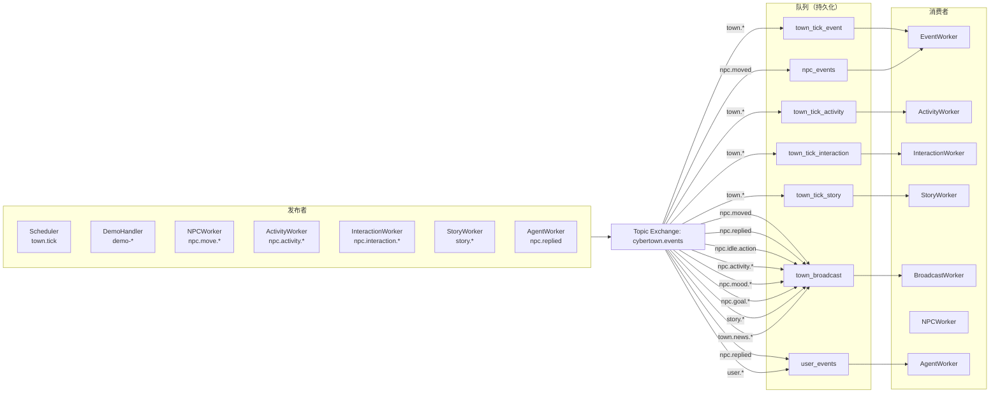

### 2.2 事件类型全集

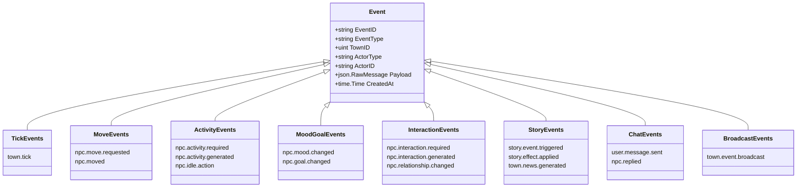

### 2.3 NPC 移动全链路

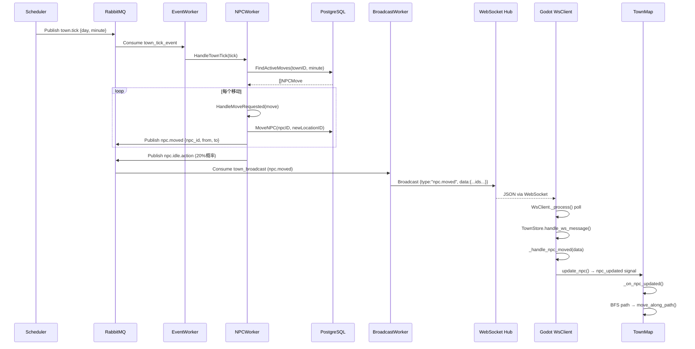

---

## 三、NPC 系统设计

### 3.1 OCEAN 人格模型

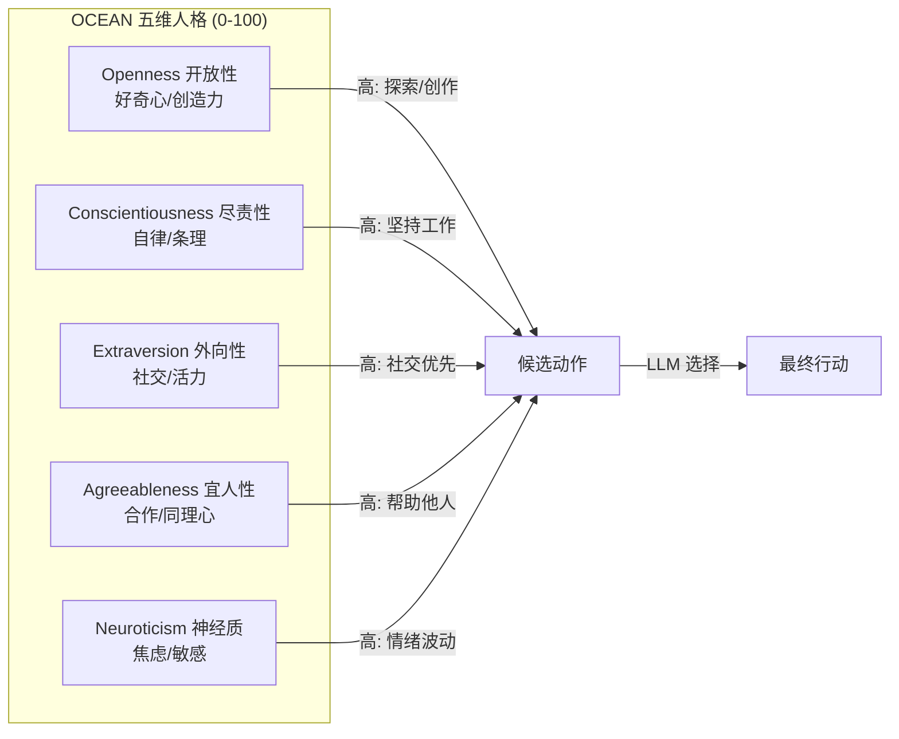

### 3.2 15 个 NPC 数据表

| ID  | 姓名  | 角色    | 位置(ID)   | 初始心情      | OCEAN (O/C/E/A/N) | 口头禅              |
| --- | --- | ----- | -------- | --------- | ----------------- | ---------------- |
| 34  | 埃德蒙 | 镇长    | 市政厅(41)  | content   | 70/90/85/88/40    | 小镇虽小，每个人都很重要     |
| 35  | 莉娜  | 咖啡馆主  | 咖啡馆(39)  | cheerful  | 75/85/90/92/35    | 来杯咖啡吗？今天的故事配咖啡正好 |
| 36  | 艾琳  | 图书管理员 | 图书馆(42)  | calm      | 85/80/55/75/30    | 每本书都有它的读者        |
| 37  | 菲奥娜 | 花店店主  | 花店(43)   | happy     | 90/70/80/85/45    | 每一朵花都有它的花语       |
| 38  | 奥托  | 铁匠    | 钟楼(40)   | focused   | 65/95/60/70/55    | 好的手艺需要时间         |
| 39  | 克莱尔 | 医生    | 诊所(45)   | composed  | 80/90/65/88/40    | 健康是最大的财富         |
| 40  | 杰克  | 农夫    | 农舍(46)   | content   | 60/85/65/80/30    | 土地不会骗人           |
| 41  | 沃尔特 | 渔夫    | 钓鱼小屋(47) | peaceful  | 55/75/40/75/25    | 耐心是最好的鱼饵         |
| 42  | 索菲亚 | 教师    | 学校(48)   | warm      | 80/85/75/90/35    | 每个孩子都是一颗星星       |
| 43  | 皮埃尔 | 面包师   | 面包店(49)  | jolly     | 70/88/85/80/30    | 新鲜出炉的幸福！         |
| 44  | 玛莎  | 酒馆老板  | 酒馆(50)   | friendly  | 65/80/90/85/35    | 一杯好酒和一个好听众       |
| 45  | 卢卡斯 | 音乐家   | 公园凉亭(51) | dreamy    | 95/55/65/75/60    | 音乐是心灵的语言         |
| 46  | 托马斯 | 木匠    | 手工工坊(52) | steady    | 70/90/55/78/25    | 好木头会说话           |
| 47  | 米娅  | 小女孩   | 住宅区(53)  | playful   | 90/50/85/80/50    | 我已经不是小孩子了！       |
| 48  | 薇拉  | 冒险者   | 森林营地(54) | confident | 88/65/75/70/45    | 冒险在召唤！           |

### 3.3 位置感知活动模板

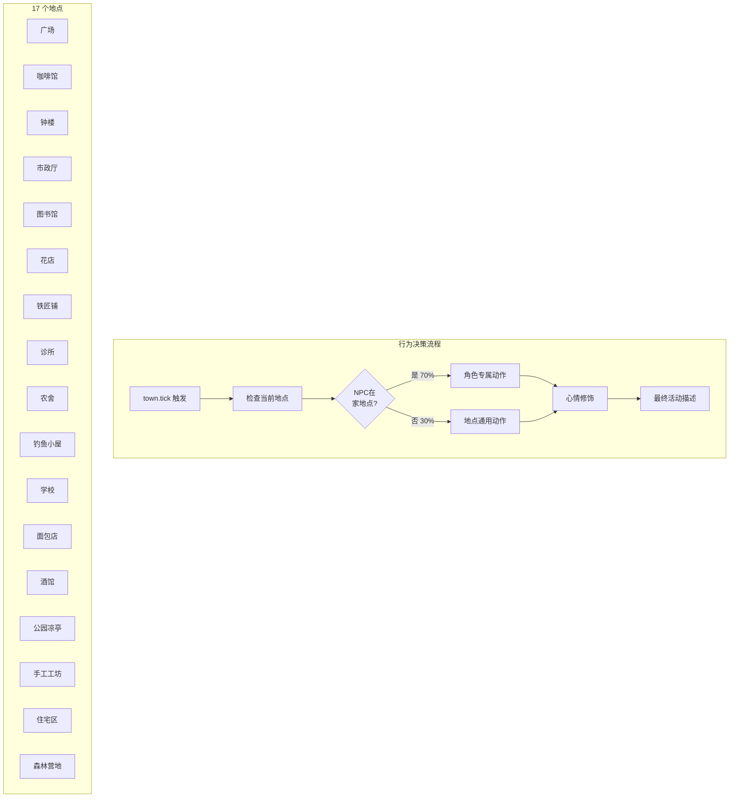

### 3.4 NPC 日程系统

每个 NPC 有 5 个时间段，覆盖 05:00-22:00：

```mermaid
gantt
    title 莉娜（咖啡馆主）日程
    dateFormat HH:mm
    axisFormat %H:%M

    section 莉娜
    开店营业   :07:30, 12:00
    午间忙时   :12:00, 14:00
    下午营业   :15:00, 18:00
    休息       :14:00, 15:00
    回家       :18:00, 22:00
```

---

## 四、前端架构

### 4.1 组件树与数据流

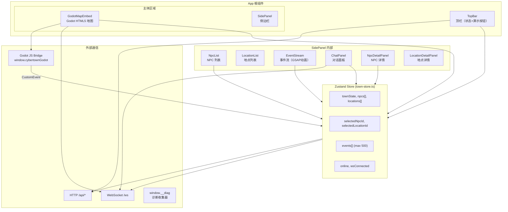

### 4.2 双通道事件流

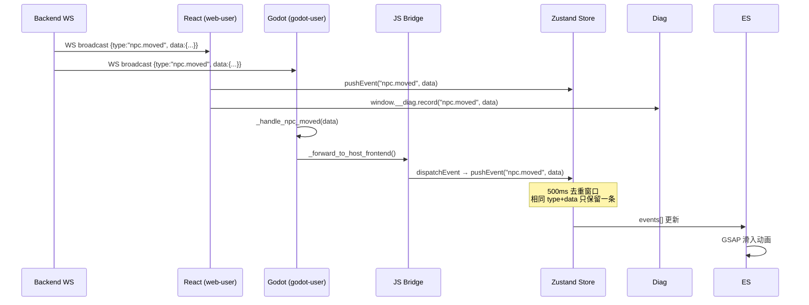

---

## 五、Godot 地图设计

### 5.1 地图坐标系统

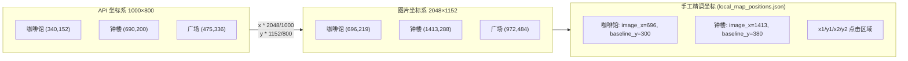

### 5.2 NPC 移动动画流程

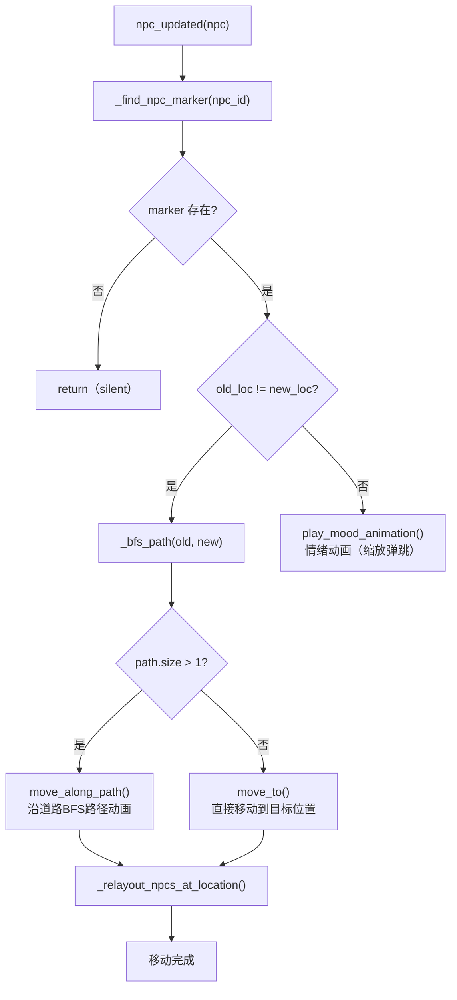

### 5.3 JS 桥接接口

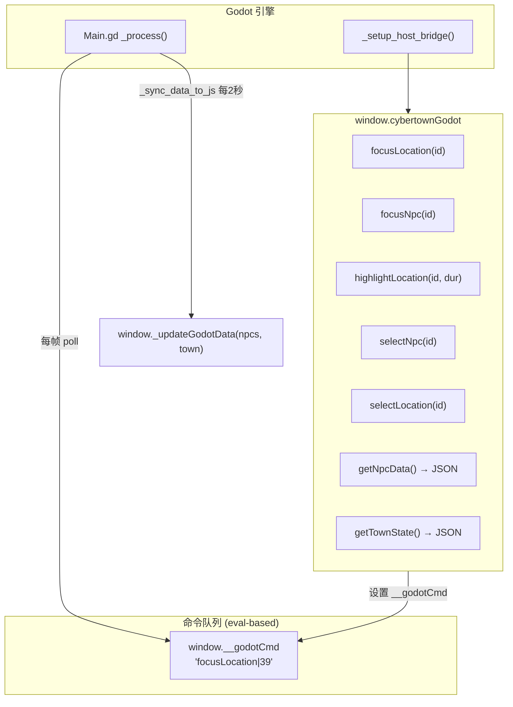

---

## 六、演示脚本设计

### 6.1 三幕结构

```mermaid
timeline
    title 演示脚本时间线 (~125秒)

    section ACT 1: 清晨日常 (0-19s)
        0s : 晨曦日报：新的一天开始
        3s : 4个NPC目标更新（莉娜/奥托/皮埃尔/菲奥娜）
        6s : 3个NPC移动到工作岗位
        11s : 3个NPC开始工作活动
        16s : 情绪更新

    section ACT 2: 钟楼检修 (19-66s)
        19s : 故事事件触发：钟楼维护日
        22s : 3个NPC目标变更（奥托/埃德蒙/托马斯）
        27s : 埃德蒙+托马斯移动到钟楼
        32s : 3个NPC工作活动
        40s : 莉娜送咖啡到钟楼
        45s : 莉娜↔奥托对话
        53s : 皮埃尔送可颂到钟楼
        58s : 菲奥娜送花到钟楼

    section ACT 3: 修复完成 (66-125s)
        66s : 新闻：钟楼修好
        69s : 目标更新+情绪变化
        77s : 4个NPC返回工作岗位
        85s : 晚间新闻：酒馆庆祝
        88s : 4个NPC移动到酒馆
        96s : 酒馆活动+卢卡斯演奏
        104s : 奥托↔玛莎对话
        112s : NPC返回住宅区
        122s : 情绪恢复+最终日报
```

### 6.2 NPC 移动轨迹

| NPC     | ACT1    | ACT2    | ACT3 返回 | ACT3 晚间 | 尾声      |
| ------- | ------- | ------- | ------- | ------- | ------- |
| 埃德蒙(34) | -       | 市政厅→钟楼  | 钟楼→市政厅  | 市政厅→酒馆  | 酒馆→住宅区  |
| 莉娜(35)  | 住宅区→咖啡馆 | 咖啡馆→钟楼  | 钟楼→咖啡馆  | -       | -       |
| 菲奥娜(37) | -       | 花店→钟楼   | 钟楼→花店   | -       | -       |
| 奥托(38)  | 住宅区→钟楼  | -       | -       | 钟楼→酒馆   | 酒馆→住宅区  |
| 皮埃尔(43) | 住宅区→面包店 | 面包店→钟楼  | 钟楼→面包店  | -       | -       |
| 卢卡斯(45) | -       | -       | -       | 公园凉亭→酒馆 | 酒馆→公园凉亭 |
| 托马斯(46) | -       | 手工工坊→钟楼 | -       | 钟楼→酒馆   | 酒馆→住宅区  |

---

## 七、诊断与监控

### 7.1 三层诊断体系

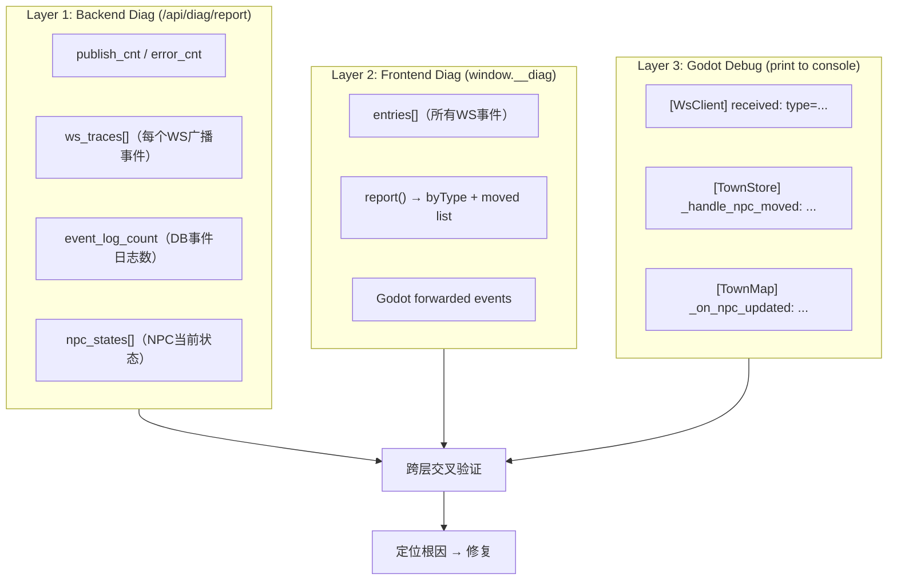

### 7.2 已修复的关键问题

| #   | 问题                 | 根因                      | 修复                                |
| --- | ------------------ | ----------------------- | --------------------------------- |
| 1   | diag追踪丢失事件         | Report浅拷贝导致数据竞争         | deep copy traces                  |
| 2   | Raw payload事件无追踪   | json.RawMessage未解析      | Push()中增加Unmarshal回退              |
| 3   | Demo事件丢失           | time.Now().UnixNano()重复 | atomic.Int64序号器                   |
| 4   | RabbitMQ批量丢消息      | 快速连续Publish通道缓冲溢出       | 10ms间隔 + 直连广播                     |
| 5   | 演示move无location_id | DemoHandler未解析地名        | locNameToID预解析                    |
| 6   | Hub.Run()未启动       | main.go遗漏goroutine调用    | 添加 go wsServer.Hub.Run()          |
| 7   | GORM Update静默失败    | Model(npc)导致WHERE条件错误   | 改为 Model(&NPC{}).Where("id=?",id) |

---

## 八、部署配置

### 8.1 基础设施端口

| 服务              | 端口    | 用途                   |
| --------------- | ----- | -------------------- |
| Go Backend      | 8080  | HTTP API + WebSocket |
| Vite Dev Server | 5173  | React 前端开发           |
| PostgreSQL      | 15432 | 持久化（GORM）            |
| Redis           | 6380  | 短期记忆缓存               |
| RabbitMQ        | 60002 | 事件总线 (AMQP)          |
| RabbitMQ Mgmt   | 15672 | 管理界面                 |
| Qdrant          | 6334  | 向量数据库 (RAG)          |

### 8.2 启动顺序

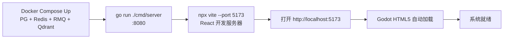
