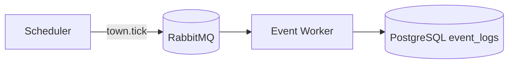
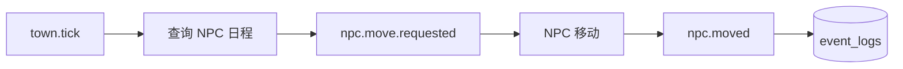
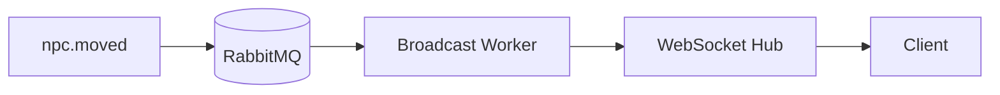
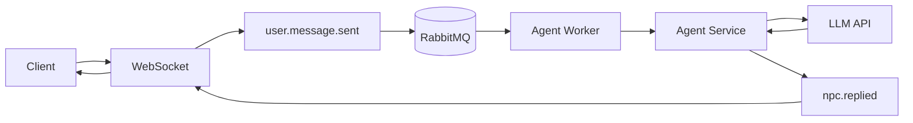
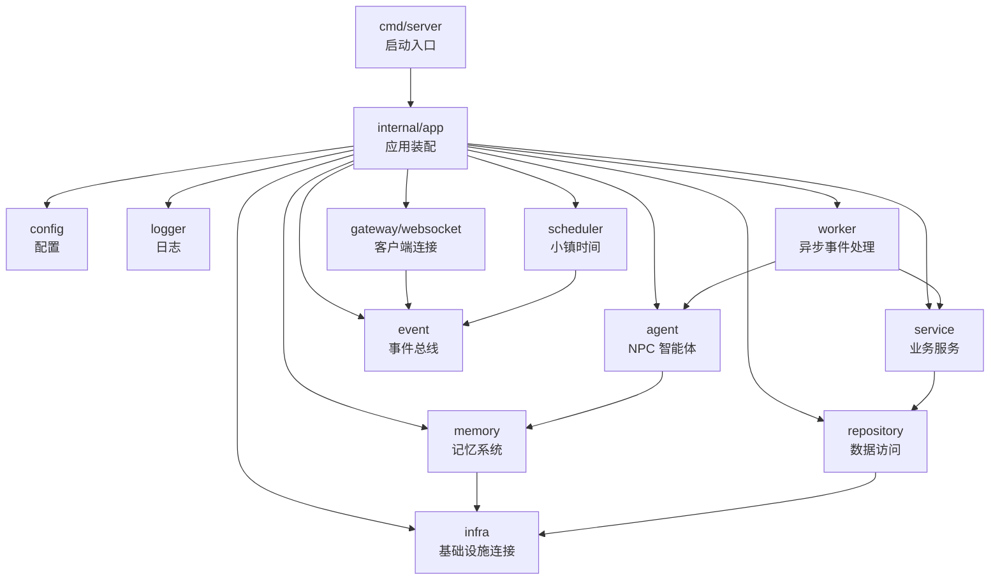
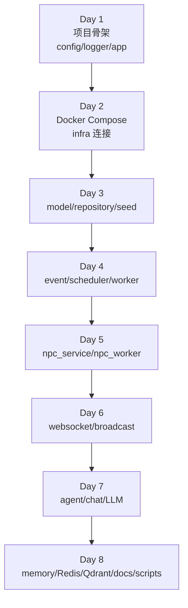
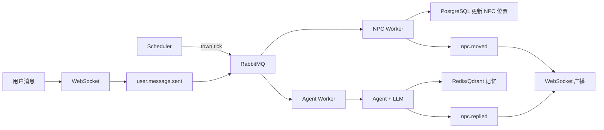

## 🤖 Assistant

下面给你一份 **8 天最小可运行 AI 小镇项目目录演进 tree**，每天只增加当日必要内容，并标注每个目录/文件作用。

项目名假设为：

```text
ai-town/
```

---

# Day 1：项目骨架、配置、日志

目标：项目能启动，能读取配置，能输出结构化日志。

```text
ai-town/
├── cmd/
│   └── server/
│       └── main.go                  # 服务启动入口，负责启动 app
├── configs/
│   └── config.yaml                  # 本地开发配置文件
├── internal/
│   ├── app/
│   │   └── app.go                   # 应用初始化与生命周期管理
│   ├── config/
│   │   └── config.go                # Viper 配置加载
│   └── logger/
│       └── logger.go                # slog 日志初始化
├── pkg/
│   └── errors/
│       └── errors.go                # 通用错误定义，可选
├── .env.example                     # 环境变量示例
├── .gitignore
├── go.mod
└── README.md                        # 项目说明与启动方式
```

### Day 1 作用说明

- `cmd/server/main.go`：唯一启动入口。
- `internal/app`：后续统一启动 DB、Redis、RabbitMQ、WebSocket、Scheduler。
- `internal/config`：集中管理配置，避免散落读取环境变量。
- `internal/logger`：统一日志格式，方便后续排查事件流。
- `configs/config.yaml`：本地开发默认配置。

---

# Day 2：Docker Compose 和基础设施连接

目标：PostgreSQL、Redis、RabbitMQ、Qdrant 能一键启动，Go 服务能连通。

```text
ai-town/
├── cmd/
│   └── server/
│       └── main.go                  # 启动入口
├── configs/
│   └── config.yaml                  # 增加 DB/Redis/RabbitMQ/Qdrant 配置
├── deployments/
│   └── docker-compose.yml           # PostgreSQL/Redis/RabbitMQ/Qdrant 编排
├── internal/
│   ├── app/
│   │   └── app.go                   # 初始化基础设施连接
│   ├── config/
│   │   └── config.go                # 读取基础设施配置
│   ├── infra/
│   │   ├── postgres.go              # PostgreSQL/GORM 连接
│   │   ├── redis.go                 # Redis 客户端初始化
│   │   ├── rabbitmq.go              # RabbitMQ 连接初始化
│   │   └── qdrant.go                # Qdrant 客户端初始化
│   └── logger/
│       └── logger.go                # slog 日志初始化
├── .env.example
├── go.mod
└── README.md
```

### Day 2 新增作用

- `deployments/docker-compose.yml`：本地依赖一键启动。
- `internal/infra/postgres.go`：创建 GORM DB 实例。
- `internal/infra/redis.go`：创建 Redis Client。
- `internal/infra/rabbitmq.go`：创建 RabbitMQ 连接。
- `internal/infra/qdrant.go`：初始化 Qdrant 客户端。

---

# Day 3：数据模型、GORM、种子数据

目标：数据库中有小镇、地点、NPC、日程。

```text
ai-town/
├── cmd/
│   └── server/
│       └── main.go
├── configs/
│   └── config.yaml
├── deployments/
│   └── docker-compose.yml
├── internal/
│   ├── app/
│   │   └── app.go                   # 启动时执行 migrate 和 seed
│   ├── config/
│   │   └── config.go
│   ├── infra/
│   │   ├── postgres.go
│   │   ├── redis.go
│   │   ├── rabbitmq.go
│   │   └── qdrant.go
│   ├── model/
│   │   ├── town.go                  # Town 小镇模型
│   │   ├── location.go              # Location 地点模型
│   │   ├── npc.go                   # NPC 模型
│   │   ├── npc_schedule.go          # NPC 日程模型
│   │   ├── event_log.go             # 事件日志模型
│   │   └── chat_message.go          # 聊天记录模型
│   ├── repository/
│   │   ├── town_repository.go       # 小镇数据访问
│   │   ├── location_repository.go   # 地点数据访问
│   │   ├── npc_repository.go        # NPC 数据访问
│   │   └── event_repository.go      # 事件日志数据访问
│   ├── seed/
│   │   └── seed.go                  # 初始化晨曦镇、地点、NPC、日程
│   └── logger/
│       └── logger.go
├── .env.example
├── go.mod
└── README.md
```

### Day 3 新增作用

- `internal/model`：数据库表结构定义。
- `internal/repository`：隔离 GORM 操作，业务层不直接操作数据库。
- `internal/seed/seed.go`：初始化最小演示数据。

### 最小数据

```text
晨曦镇
├── 广场
├── 咖啡馆
└── 钟楼

NPC
├── 莉娜：咖啡师
├── 奥托：钟表匠
└── 米娅：邮差
```

---

# Day 4：RabbitMQ 事件总线 + Scheduler

目标：小镇开始产生 `town.tick` 事件。

```text
ai-town/
├── cmd/
│   └── server/
│       └── main.go
├── configs/
│   └── config.yaml
├── deployments/
│   └── docker-compose.yml
├── internal/
│   ├── app/
│   │   └── app.go                   # 启动 EventBus、Worker、Scheduler
│   ├── config/
│   │   └── config.go
│   ├── event/
│   │   ├── event.go                 # 统一事件结构定义
│   │   ├── event_type.go            # 事件类型常量
│   │   ├── publisher.go             # RabbitMQ 事件发布器
│   │   ├── consumer.go              # RabbitMQ 事件消费者
│   │   └── codec.go                 # 事件 JSON 编解码
│   ├── scheduler/
│   │   └── scheduler.go             # 定时推进小镇时间，发布 town.tick
│   ├── worker/
│   │   └── event_worker.go          # 消费 town.tick，写入 event_logs
│   ├── service/
│   │   └── town_service.go          # 推进小镇时间
│   ├── model/
│   │   ├── town.go
│   │   ├── location.go
│   │   ├── npc.go
│   │   ├── npc_schedule.go
│   │   ├── event_log.go
│   │   └── chat_message.go
│   ├── repository/
│   │   ├── town_repository.go
│   │   ├── location_repository.go
│   │   ├── npc_repository.go
│   │   └── event_repository.go
│   ├── infra/
│   │   ├── postgres.go
│   │   ├── redis.go
│   │   ├── rabbitmq.go
│   │   └── qdrant.go
│   ├── seed/
│   │   └── seed.go
│   └── logger/
│       └── logger.go
├── .env.example
├── go.mod
└── README.md
```

### Day 4 新增作用

- `internal/event`：系统事件协议核心。
- `internal/scheduler`：定时推进小镇时间。
- `internal/worker/event_worker.go`：消费事件并处理。
- `internal/service/town_service.go`：封装小镇时间推进逻辑。

### 当前事件流



---

# Day 5：NPC 日程和移动

目标：NPC 根据日程自动移动。

```text
ai-town/
├── cmd/
│   └── server/
│       └── main.go
├── configs/
│   └── config.yaml
├── deployments/
│   └── docker-compose.yml
├── internal/
│   ├── app/
│   │   └── app.go
│   ├── config/
│   │   └── config.go
│   ├── event/
│   │   ├── event.go
│   │   ├── event_type.go            # 新增 npc.move.requested / npc.moved
│   │   ├── publisher.go
│   │   ├── consumer.go
│   │   └── codec.go
│   ├── scheduler/
│   │   └── scheduler.go
│   ├── worker/
│   │   ├── event_worker.go          # 路由不同事件类型
│   │   └── npc_worker.go            # 处理 NPC 移动相关事件
│   ├── service/
│   │   ├── town_service.go          # 小镇时间和地点状态
│   │   └── npc_service.go           # NPC 日程查询、移动、状态更新
│   ├── model/
│   │   ├── town.go
│   │   ├── location.go
│   │   ├── npc.go
│   │   ├── npc_schedule.go
│   │   ├── event_log.go
│   │   └── chat_message.go
│   ├── repository/
│   │   ├── town_repository.go
│   │   ├── location_repository.go
│   │   ├── npc_repository.go        # 新增查找当前时间应行动 NPC
│   │   ├── schedule_repository.go   # NPC 日程数据访问
│   │   └── event_repository.go
│   ├── infra/
│   │   ├── postgres.go
│   │   ├── redis.go
│   │   ├── rabbitmq.go
│   │   └── qdrant.go
│   ├── seed/
│   │   └── seed.go
│   └── logger/
│       └── logger.go
├── .env.example
├── go.mod
└── README.md
```

### Day 5 新增作用

- `internal/worker/npc_worker.go`：处理 `town.tick` 后的 NPC 行动。
- `internal/service/npc_service.go`：封装 NPC 日程和移动逻辑。
- `internal/repository/schedule_repository.go`：查询 NPC 日程。

### 当前事件流



---

# Day 6：WebSocket 网关和广播

目标：客户端能实时收到 NPC 移动事件。

```text
ai-town/
├── cmd/
│   └── server/
│       └── main.go
├── configs/
│   └── config.yaml
├── deployments/
│   └── docker-compose.yml
├── internal/
│   ├── app/
│   │   └── app.go                   # 启动 WebSocket Gateway
│   ├── config/
│   │   └── config.go
│   ├── gateway/
│   │   └── websocket/
│   │       ├── server.go            # WebSocket HTTP 服务
│   │       ├── client.go            # 单个连接封装
│   │       ├── hub.go               # 连接管理、广播中心
│   │       ├── message.go           # WebSocket 消息结构
│   │       └── handler.go           # 连接、读写、心跳处理
│   ├── broadcast/
│   │   └── broadcast_service.go     # 统一推送小镇事件
│   ├── event/
│   │   ├── event.go
│   │   ├── event_type.go            # 新增 town.event.broadcast
│   │   ├── publisher.go
│   │   ├── consumer.go
│   │   └── codec.go
│   ├── scheduler/
│   │   └── scheduler.go
│   ├── worker/
│   │   ├── event_worker.go
│   │   ├── npc_worker.go
│   │   └── broadcast_worker.go      # 消费 npc.moved 并推送 WebSocket
│   ├── service/
│   │   ├── town_service.go
│   │   └── npc_service.go
│   ├── model/
│   │   ├── town.go
│   │   ├── location.go
│   │   ├── npc.go
│   │   ├── npc_schedule.go
│   │   ├── event_log.go
│   │   └── chat_message.go
│   ├── repository/
│   │   ├── town_repository.go
│   │   ├── location_repository.go
│   │   ├── npc_repository.go
│   │   ├── schedule_repository.go
│   │   └── event_repository.go
│   ├── infra/
│   │   ├── postgres.go
│   │   ├── redis.go
│   │   ├── rabbitmq.go
│   │   └── qdrant.go
│   ├── seed/
│   │   └── seed.go
│   └── logger/
│       └── logger.go
├── .env.example
├── go.mod
└── README.md
```

### Day 6 新增作用

- `internal/gateway/websocket`：负责客户端实时连接。
- `internal/broadcast`：统一封装推送逻辑。
- `internal/worker/broadcast_worker.go`：把事件转成 WebSocket 消息。

### 当前实时链路



---

# Day 7：Agent 对话链路

目标：用户能通过 WebSocket 给 NPC 发消息，NPC 调用 LLM 回复。

```text
ai-town/
├── cmd/
│   └── server/
│       └── main.go
├── configs/
│   └── config.yaml                  # 增加 LLM API 配置
├── deployments/
│   └── docker-compose.yml
├── internal/
│   ├── app/
│   │   └── app.go
│   ├── config/
│   │   └── config.go
│   ├── gateway/
│   │   └── websocket/
│   │       ├── server.go
│   │       ├── client.go
│   │       ├── hub.go
│   │       ├── message.go           # 新增 user.message 消息类型
│   │       └── handler.go           # 接收用户消息并发布事件
│   ├── agent/
│   │   ├── agent_service.go         # Agent 对外入口
│   │   ├── prompt_builder.go        # 拼装 NPC 人设/状态/用户输入
│   │   ├── llm_client.go            # LLM API 调用封装
│   │   ├── eino_runner.go           # Eino 编排入口
│   │   └── hello_agent_adapter.go   # helloAgent_go 适配层
│   ├── chat/
│   │   └── chat_service.go          # 聊天消息保存与读取
│   ├── broadcast/
│   │   └── broadcast_service.go
│   ├── event/
│   │   ├── event.go
│   │   ├── event_type.go            # 新增 user.message.sent / npc.replied
│   │   ├── publisher.go
│   │   ├── consumer.go
│   │   └── codec.go
│   ├── scheduler/
│   │   └── scheduler.go
│   ├── worker/
│   │   ├── event_worker.go
│   │   ├── npc_worker.go
│   │   ├── broadcast_worker.go
│   │   └── agent_worker.go          # 消费用户消息，调用 Agent 回复
│   ├── service/
│   │   ├── town_service.go
│   │   └── npc_service.go
│   ├── model/
│   │   ├── town.go
│   │   ├── location.go
│   │   ├── npc.go
│   │   ├── npc_schedule.go
│   │   ├── event_log.go
│   │   └── chat_message.go
│   ├── repository/
│   │   ├── town_repository.go
│   │   ├── location_repository.go
│   │   ├── npc_repository.go
│   │   ├── schedule_repository.go
│   │   ├── event_repository.go
│   │   └── chat_repository.go       # 聊天记录数据访问
│   ├── infra/
│   │   ├── postgres.go
│   │   ├── redis.go
│   │   ├── rabbitmq.go
│   │   └── qdrant.go
│   ├── seed/
│   │   └── seed.go
│   └── logger/
│       └── logger.go
├── .env.example
├── go.mod
└── README.md
```

### Day 7 新增作用

- `internal/agent`：NPC 思考和回复核心。
- `internal/chat`：聊天业务。
- `internal/worker/agent_worker.go`：异步处理用户消息。
- `internal/repository/chat_repository.go`：保存对话记录。

### 当前对话链路



---

# Day 8：Redis 短期记忆、Qdrant 长期记忆、演示闭环

目标：NPC 能记住最近对话，重要记忆进入 Qdrant，完成 MVP。

```text
ai-town/
├── cmd/
│   └── server/
│       └── main.go
├── configs/
│   └── config.yaml
├── deployments/
│   └── docker-compose.yml
├── docs/
│   ├── architecture.md              # MVP 架构说明
│   ├── events.md                    # 事件类型说明
│   └── demo.md                      # 演示脚本
├── scripts/
│   ├── dev.sh                       # 本地启动脚本
│   └── ws_test.html                 # 简单 WebSocket 测试页面
├── internal/
│   ├── app/
│   │   └── app.go                   # 启动所有模块
│   ├── config/
│   │   └── config.go
│   ├── gateway/
│   │   └── websocket/
│   │       ├── server.go
│   │       ├── client.go
│   │       ├── hub.go
│   │       ├── message.go
│   │       └── handler.go
│   ├── agent/
│   │   ├── agent_service.go         # 对话入口，接入记忆
│   │   ├── prompt_builder.go        # 拼装人设、状态、短期记忆、长期记忆
│   │   ├── llm_client.go
│   │   ├── eino_runner.go
│   │   └── hello_agent_adapter.go
│   ├── memory/
│   │   ├── memory_service.go        # 记忆服务统一入口
│   │   ├── short_memory.go          # Redis 最近对话
│   │   ├── long_memory.go           # Qdrant 长期记忆
│   │   ├── embedding.go             # 文本向量化，调用 embedding API 或 mock
│   │   └── qdrant_collection.go     # 初始化 Qdrant collection
│   ├── chat/
│   │   └── chat_service.go
│   ├── broadcast/
│   │   └── broadcast_service.go
│   ├── event/
│   │   ├── event.go
│   │   ├── event_type.go
│   │   ├── publisher.go
│   │   ├── consumer.go
│   │   └── codec.go
│   ├── scheduler/
│   │   └── scheduler.go
│   ├── worker/
│   │   ├── event_worker.go
│   │   ├── npc_worker.go
│   │   ├── broadcast_worker.go
│   │   ├── agent_worker.go
│   │   └── memory_worker.go         # 可选，异步保存长期记忆
│   ├── service/
│   │   ├── town_service.go
│   │   └── npc_service.go
│   ├── model/
│   │   ├── town.go
│   │   ├── location.go
│   │   ├── npc.go
│   │   ├── npc_schedule.go
│   │   ├── event_log.go
│   │   └── chat_message.go
│   ├── repository/
│   │   ├── town_repository.go
│   │   ├── location_repository.go
│   │   ├── npc_repository.go
│   │   ├── schedule_repository.go
│   │   ├── event_repository.go
│   │   └── chat_repository.go
│   ├── infra/
│   │   ├── postgres.go
│   │   ├── redis.go
│   │   ├── rabbitmq.go
│   │   └── qdrant.go
│   ├── seed/
│   │   ├── seed.go                  # 小镇/NPC/日程初始化
│   │   └── world_knowledge.go       # 世界知识初始化到 Qdrant
│   └── logger/
│       └── logger.go
├── .env.example
├── .gitignore
├── go.mod
└── README.md
```

### Day 8 新增作用

- `internal/memory`：短期记忆和长期记忆统一管理。
- `short_memory.go`：Redis 最近对话。
- `long_memory.go`：Qdrant 长期记忆检索和写入。
- `embedding.go`：文本转向量，MVP 可先 mock。
- `scripts/ws_test.html`：不用前端项目也能测试 WebSocket。
- `docs/demo.md`：8 天成果演示流程。

---

# 最终目录结构分层说明



---

# 最终目录职责总览

| 目录                           | 作用                                  |
| ---------------------------- | ----------------------------------- |
| `cmd/server`                 | 程序启动入口                              |
| `configs`                    | 配置文件                                |
| `deployments`                | Docker Compose 部署编排                 |
| `docs`                       | 架构、事件、演示文档                          |
| `scripts`                    | 本地开发和测试脚本                           |
| `internal/app`               | 依赖装配、生命周期管理                         |
| `internal/config`            | Viper 配置加载                          |
| `internal/logger`            | slog 日志初始化                          |
| `internal/infra`             | PostgreSQL、Redis、RabbitMQ、Qdrant 连接 |
| `internal/model`             | GORM 数据模型                           |
| `internal/repository`        | 数据访问层                               |
| `internal/service`           | 小镇、NPC 等核心业务                        |
| `internal/event`             | 统一事件结构、发布、消费                        |
| `internal/scheduler`         | 小镇时间流动                              |
| `internal/worker`            | RabbitMQ 消费任务                       |
| `internal/gateway/websocket` | WebSocket 实时通信                      |
| `internal/broadcast`         | 小镇事件广播                              |
| `internal/agent`             | Eino、helloAgent_go、LLM 回复编排         |
| `internal/memory`            | Redis 短期记忆、Qdrant 长期记忆              |
| `internal/chat`              | 用户与 NPC 对话业务                        |
| `internal/seed`              | 初始化小镇数据和世界知识                        |
| `pkg`                        | 可复用公共包，尽量少放                         |

---

# 8 天目录演进图



---

# 建议最终保持的核心原则

## 1. 不要过早微服务化

当前目录是 **模块化单体**，但边界清晰，后面可以拆成：

```text
Town Service
NPC Service
Agent Service
Memory Service
Gateway Service
```

## 2. gRPC 先预留，不强行引入复杂度

8 天 MVP 里可以先用 Go interface 分层。等功能跑通后，再把这些模块暴露成 gRPC：

```text
AgentService.GenerateReply
MemoryService.SearchMemory
TownService.UpdateNPCPosition
NPCService.ListDueSchedules
```

## 3. 事件优先

AI 小镇的生命力来自事件流：

```text
town.tick
npc.move.requested
npc.moved
user.message.sent
npc.replied
npc.memory.saved
```

所以 `internal/event` 是核心基础设施，不要随便散落事件结构。

---

# 最小可运行最终闭环



最终第 8 天，你的项目目录应该支撑这句话：

> 小镇自己流动，NPC 会移动，用户能对话，NPC 有记忆，所有变化都通过事件驱动并实时推送。
