## 🤖 Assistant

很好，这套技术栈适合直接做“**第二阶段：让小镇动起来**”。建议定位为：

> **模块化单体优先 + 内部 gRPC 边界 + RabbitMQ 事件驱动 + WebSocket 实时推送**

也就是：先不拆成多个微服务，但按未来微服务的边界来写模块，避免过早复杂化。

---

## 一、第二阶段目标定义

第二阶段核心不是“更聪明”，而是“**活起来**”。

需要实现：

- 多个 NPC
- NPC 有基础人设和状态
- 小镇有时间流动
- NPC 可按日程行动
- 用户可与 NPC 对话
- NPC 行为通过 WebSocket 实时推送
- 事件进入 RabbitMQ 异步处理
- 重要事件持久化到 PostgreSQL
- 短期状态放 Redis
- 长期记忆 / 世界知识进入 Qdrant
- Agent 通过 Eino + helloAgent_go + LLM API 生成回复和行动

---

## 二、第二阶段最小可运行范围

### 必做能力

| 能力 | 说明 |
|---|---|
| 用户连接 | WebSocket 建立连接 |
| 小镇时间 | Scheduler 周期产生 `town.tick` |
| NPC 状态 | NPC 当前地点、状态、目标 |
| NPC 日程 | 根据时间触发行动 |
| 玩家对话 | 玩家向 NPC 发送消息 |
| NPC 回复 | Agent 生成回复 |
| NPC 移动 | NPC 可切换地点 |
| 事件总线 | RabbitMQ 承载异步事件 |
| 实时广播 | WebSocket 推送 NPC 行为 |
| 记忆写入 | 对话和关键事件进入 Redis / Qdrant |
| 事件日志 | PostgreSQL 持久化事件 |

### 暂缓能力

第二阶段先不要做：

- 多 Agent 复杂协作
- 复杂任务系统
- 强剧情编辑器
- 完整后台管理
- Kubernetes
- Temporal
- 复杂权限系统
- 多模型路由
- 自动剧情生成大系统

---

## 三、推荐架构

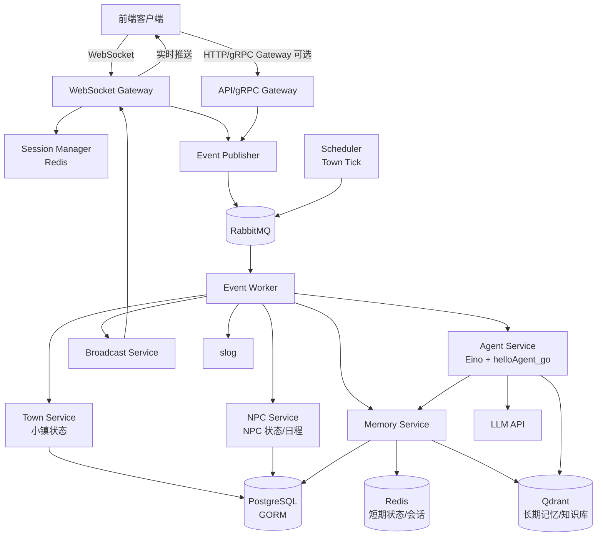

---

## 四、模块边界设计

建议后端内部按这些模块拆：

```text
internal/
├── app/                 # 应用启动、依赖注入
├── config/              # Viper 配置
├── logger/              # slog 初始化
├── gateway/
│   ├── websocket/       # WebSocket 网关
│   └── grpc/            # gRPC 服务入口
├── event/               # 事件模型、发布、消费
├── scheduler/           # 小镇时间 tick
├── town/                # 小镇、地点、世界状态
├── npc/                 # NPC 状态、日程、行为规则
├── agent/               # Eino + helloAgent_go 编排
├── memory/              # Redis + Qdrant + PostgreSQL 记忆
├── chat/                # 用户-NPC 对话
├── broadcast/           # WebSocket 广播
├── repository/          # GORM 数据访问
└── worker/              # RabbitMQ 消费 worker
```

### 为什么这样拆

- `gateway` 只负责接入，不写业务。
- `event` 是系统核心协议，先定义好事件类型。
- `town` 管小镇世界状态。
- `npc` 管 NPC 自身状态和日程。
- `agent` 只负责“思考与决策”。
- `memory` 管记忆，不让 Agent 直接碰数据库细节。
- `worker` 负责把事件串起来。

---

## 五、核心事件设计

第二阶段建议先定义这些事件：

```text
town.tick
npc.schedule.due
npc.move.requested
npc.moved
user.message.sent
npc.reply.requested
npc.replied
npc.memory.save_requested
npc.memory.saved
town.event.broadcast
```

### 事件流关系

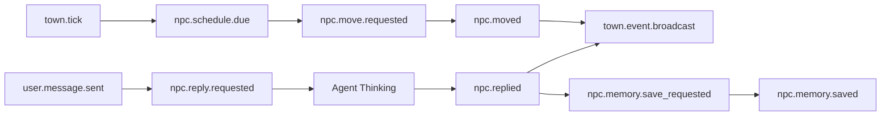

---

## 六、第二阶段运行主流程

### 1. 小镇自动运行流程

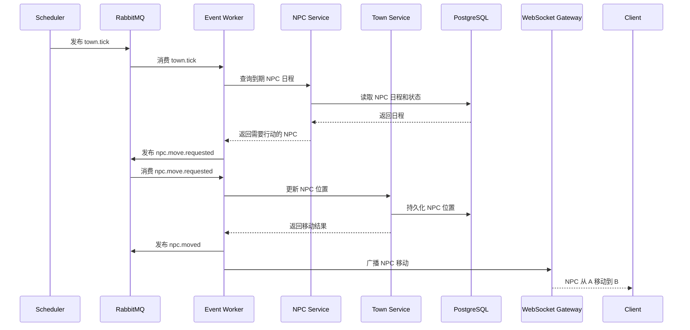

---

### 2. 用户对话流程

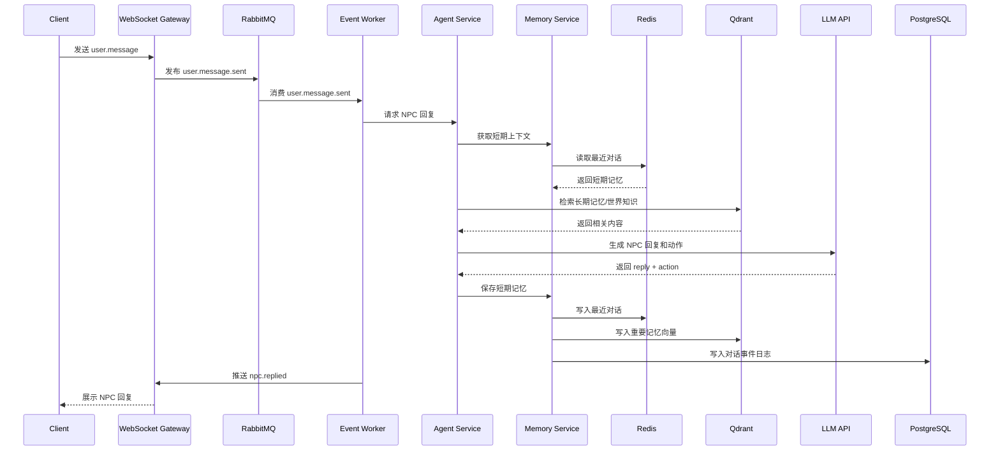

---

## 七、gRPC 怎么用

第二阶段建议：

> 外部主要用 WebSocket，内部模块接口用 gRPC 风格定义。

如果你当前是模块化单体，可以先定义 `.proto`，但不一定马上部署成多个进程。

推荐 gRPC 服务：

```text
TownService
- GetTownState
- UpdateNPCPosition
- ListLocations

NPCService
- GetNPC
- ListActiveNPCs
- ListDueSchedules
- UpdateNPCStatus

AgentService
- GenerateReply
- GenerateAction

MemoryService
- GetShortMemory
- SearchLongMemory
- SaveMemory

BroadcastService
- PushToUser
- BroadcastTownEvent
```

### gRPC 服务关系图

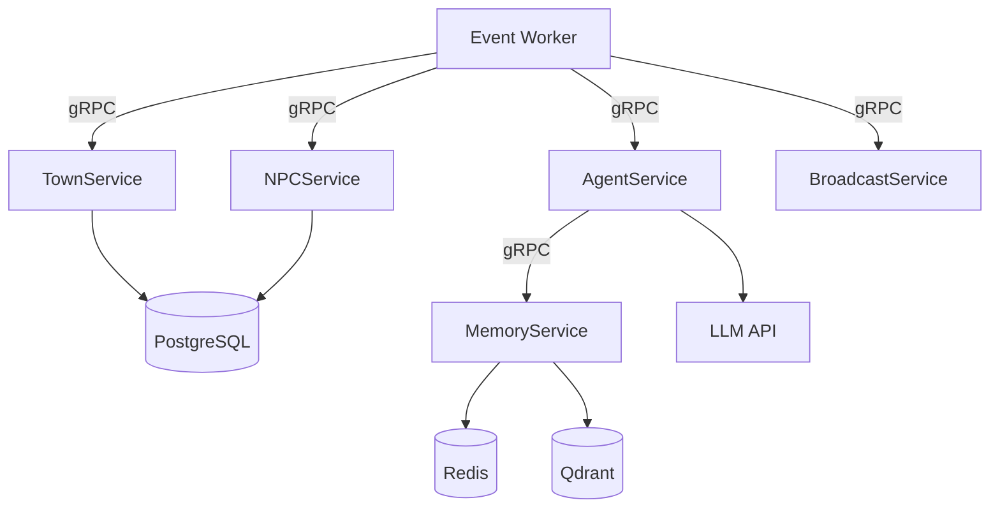

---

## 八、PostgreSQL 表设计 MVP

第二阶段够用的表：

```text
users
towns
locations
npcs
npc_schedules
npc_relationships
event_logs
chat_messages
```

### ER 图

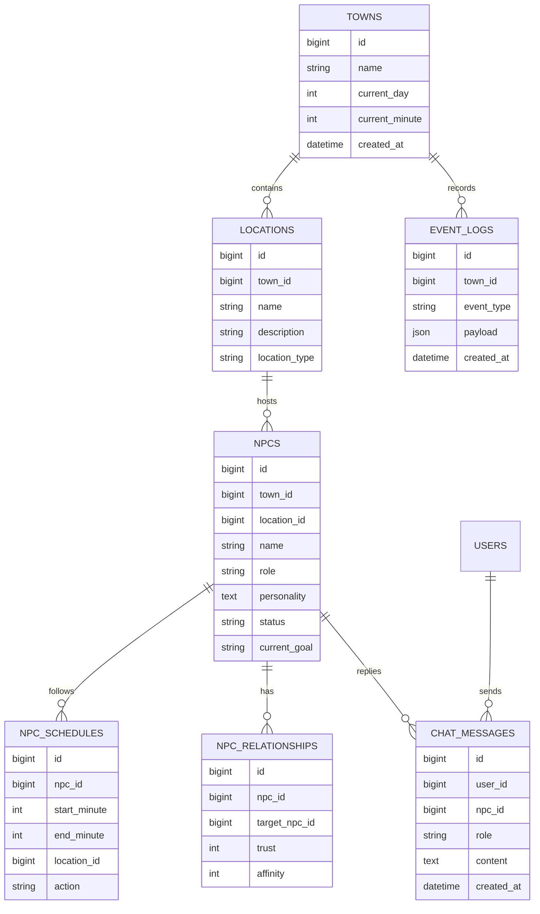

---

## 九、Redis Key 设计

```text
ws:session:{user_id}                  # 用户连接信息
town:{town_id}:state                  # 小镇当前状态缓存
npc:{npc_id}:state                    # NPC 当前状态缓存
npc:{npc_id}:recent_messages          # 最近对话列表
npc:{npc_id}:thinking_lock            # 防止同一 NPC 并发思考
scheduler:town:{town_id}:last_tick    # 上次 tick 时间
```

建议：

- 短期对话用 `List`
- 当前状态用 `Hash`
- 锁用 `SET NX EX`
- 所有 key 加 TTL，避免无限膨胀

---

## 十、Qdrant Collection 设计

建议两个 collection 起步：

```text
npc_memories
world_knowledge
```

### npc_memories payload

```json
{
  "npc_id": 1001,
  "town_id": 1,
  "memory_type": "dialogue",
  "importance": 0.82,
  "source": "chat",
  "created_at": "2025-01-01T10:00:00Z"
}
```

### world_knowledge payload

```json
{
  "town_id": 1,
  "knowledge_type": "location",
  "title": "老钟楼",
  "source": "seed_data"
}
```

---

## 十一、RabbitMQ Exchange 设计

推荐：

```text
Exchange: town.events
Type: topic
```

Routing Key：

```text
town.tick
npc.schedule.due
npc.move.requested
npc.moved
user.message.sent
npc.reply.requested
npc.replied
npc.memory.save_requested
town.event.broadcast
```

队列建议：

```text
queue.scheduler
queue.npc
queue.agent
queue.memory
queue.broadcast
queue.eventlog
```

绑定关系：

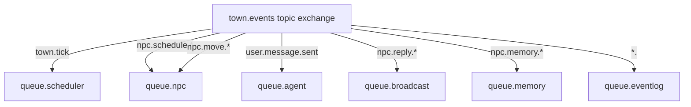

---

## 十二、Scheduler 编排

第二阶段不要复杂化，Go 内部 ticker 足够：

```text
每 5 秒真实时间 = 小镇 10 分钟
```

流程：

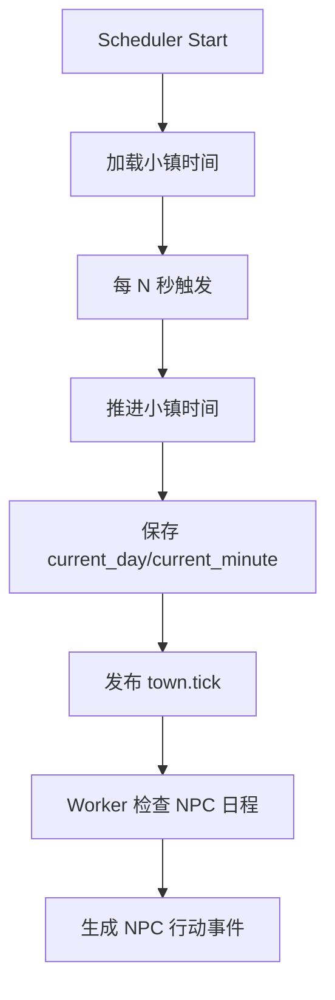

---

## 十三、Agent 编排策略

第二阶段 Agent 不要太复杂，采用：

> Observe → Retrieve → Think → Act → Remember

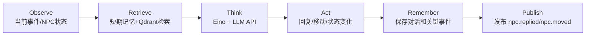

### Prompt 输入建议

Agent 输入上下文包括：

```text
NPC 人设
NPC 当前状态
NPC 当前地点
最近 5-10 条对话
相关长期记忆
相关世界知识
当前小镇时间
用户输入
可执行动作列表
```

输出建议使用 JSON：

```json
{
  "reply": "当然，我刚从钟楼那边回来。",
  "emotion": "calm",
  "action": {
    "type": "stay",
    "target_location_id": null
  },
  "memory_importance": 0.6
}
```

---

## 十四、Docker Compose 编排

第二阶段最小服务：

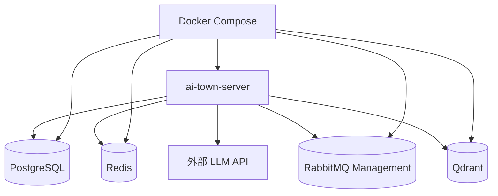

建议先不上 ES Stack。你当前第二阶段目标里没有必须依赖 ES 的核心链路，日志先用 `slog` 输出到 stdout，后面再接 Loki 或 ELK。

---

## 十五、启动顺序

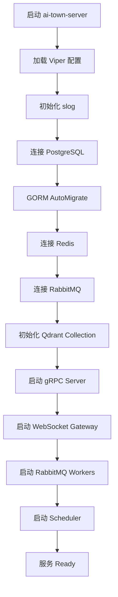

---

## 十六、推荐开发顺序

不要先写 Agent。先把事件和世界跑起来。

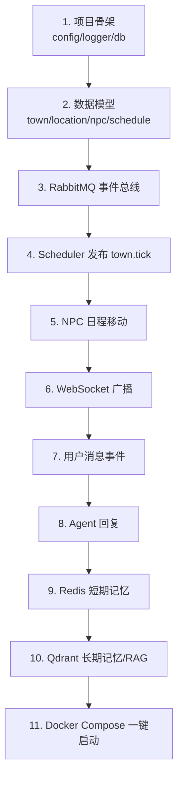

---

## 十七、第二阶段验收标准

你可以用这些标准判断是否完成：

- `docker compose up` 后所有服务启动
- 系统自动产生 `town.tick`
- 至少 3 个 NPC 根据日程自动移动
- 前端 WebSocket 能收到 NPC 移动事件
- 用户可以给任意 NPC 发消息
- NPC 能基于人设回复
- 最近对话写入 Redis
- 重要记忆写入 Qdrant
- 事件日志写入 PostgreSQL
- RabbitMQ Management 能看到事件流
- 重启服务后 NPC 基础状态可恢复

---

## 十八、最终建议

第二阶段就按这条主线做：

> **Scheduler 驱动时间 → RabbitMQ 分发事件 → Worker 更新 NPC/小镇状态 → Agent 生成行为 → WebSocket 广播变化 → Redis/Qdrant/PostgreSQL 保存状态和记忆**

技术栈定版：

```text
Go
gRPC
WebSocket
PostgreSQL + GORM
Redis
RabbitMQ
Qdrant
Eino
helloAgent_go
LLM API
Viper
log/slog
Docker Compose
```

先做“3 个 NPC 会按日程移动 + 能对话 + 有短期记忆 + WebSocket 实时展示”，这就是一个真正可演示的 AI 小镇第二阶段 MVP。
